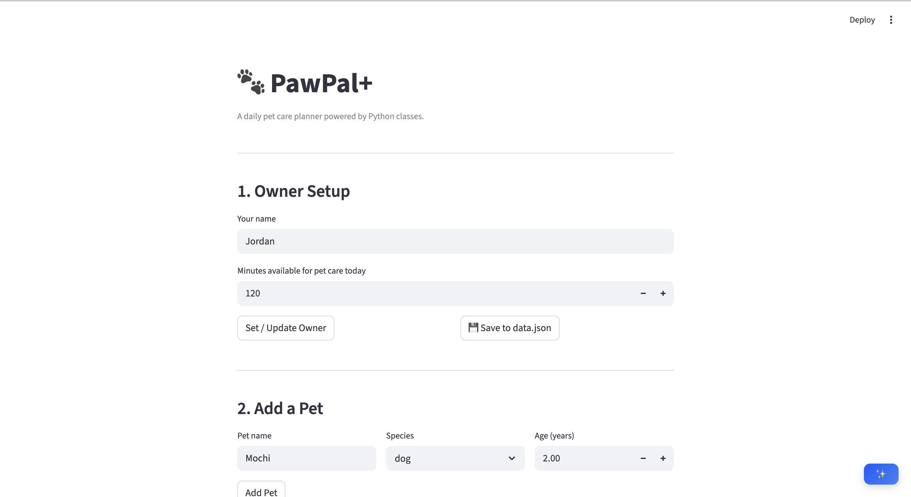
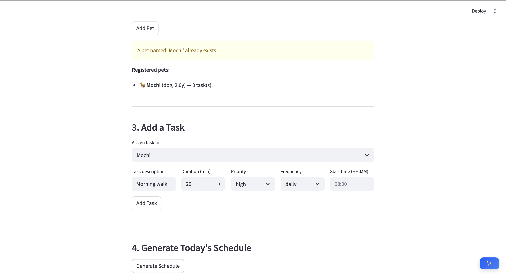
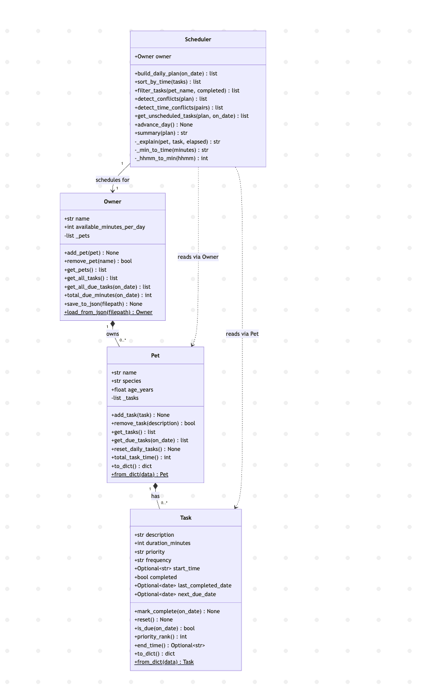

# PawPal+ (Module 2 Project)

**PawPal+** is a Streamlit app that helps a pet owner plan daily care tasks for one or more pets. It uses a priority-based greedy scheduler, conflict detection, and recurring task logic to produce a smart daily plan.

---

## Scenario

A busy pet owner needs help staying consistent with pet care. They want an assistant that can:

- Track pet care tasks (walks, feeding, meds, enrichment, grooming, etc.)
- Consider constraints (time available, priority, owner preferences)
- Produce a daily plan and explain why it chose that plan

---

## Features

- **Service-oriented UI** — The Streamlit interface is organized into clear services with a web-style top navigation bar: `Profile`, `Pets`, `Tasks`, `Schedule`, and `AI Coach`.
- **Live service metrics** — A sidebar “Service Center” shows real-time KPIs (pets, tasks, due tasks, due minutes, conflict count) so owners can quickly assess workload and schedule health.
- **Sort by time** — `Scheduler.sort_by_time()` orders tasks by their optional `start_time` field (HH:MM) using a `lambda` key with Python's `sorted()`. Tasks without a preferred time slot sort to the end automatically.
- **Filter tasks** — `Scheduler.filter_tasks()` lets you slice the full task list by pet name, completion status, or both at once.
- **Daily recurrence** — When `task.mark_complete()` is called, `next_due_date` is automatically calculated using `timedelta`: +1 day for daily tasks, +7 days for weekly tasks. `is_due()` uses this date to resurface the task at exactly the right time.
- **Conflict warnings** — `detect_time_conflicts()` scans all tasks that have a `start_time` and flags overlapping windows. Warnings are surfaced in the UI with actionable advice — the app never silently changes your schedule.
- **Priority-first greedy scheduling** — `build_daily_plan()` sorts due tasks by priority (high → medium → low), then greedily packs them into the owner's time budget. Tasks that don't fit are listed separately so nothing is silently dropped.
- **Unscheduled task list** — Tasks excluded due to time budget are shown in a dedicated table after schedule generation, with priority and duration so the owner can decide what to defer.
- **Multi-pet support** — An `Owner` can have multiple `Pet` objects, each with independent task lists. The Scheduler aggregates across all pets into one unified daily plan.
- **Data persistence** — `Owner.save_to_json()` and `Owner.load_from_json()` serialize the full object graph (owner → pets → tasks, including `date` fields) to `data.json`. The Streamlit app auto-saves on every add action and reloads on startup. Agent Mode was used to plan the symmetric `to_dict`/`from_dict` classmethod design on `Task` and `Pet` before writing any code.
- **Emoji-coded UI** — Priority levels display as 🔴 High / 🟡 Medium / 🟢 Low throughout all tables. Species and task types are given contextual icons (🐕 🐈 🐇 🦮 🍖 💊 ✂️ 🎾 etc.) for at-a-glance readability.
- **AI Coach (RAG)** — The app retrieves relevant pet-care notes from a local knowledge base and uses them to answer questions in a multi-turn chat. It ranks sources with TF-IDF, caches recent queries, and enforces citations. If `OPENAI_API_KEY` is set, responses are generated with citations; otherwise a local fallback summary is returned.

## AI Requirement Coverage

- **Useful AI behavior in main app** — In the `AI Coach` tab, PawPal+ answers pet-care questions and can include today's generated schedule as additional context.
- **Advanced feature: RAG** — `RagAssistant` retrieves the top knowledge-base notes before generation, and the model/fallback answer must be grounded in those notes.
- **Integrated behavior (not standalone)** — Retrieved sources directly shape the final response and are shown in the Streamlit UI as citations.
- **Reliability and guardrails** — The AI layer validates citation format, falls back safely when API calls fail, and logs runtime behavior to `logs/ai.log`.
- **Reproducibility** — Setup and run commands are provided below; with `.env` + `knowledge_base.json`, the same app behavior can be reproduced locally.

---

## 📸 Demo

<a href="assets/Demo1.png" target="_blank"></a>

<a href="assets/Demo2.png" target="_blank"></a>

## 🗂 System Architecture

<a href="assets/uml_final.png" target="_blank"></a>

---

## Getting started

### Setup

```bash
python -m venv .venv
source .venv/bin/activate  # Windows: .venv\Scripts\activate
pip install -r requirements.txt
```

### Run the Streamlit app

```bash
streamlit run app.py
```

### Optional: enable AI responses

Set an OpenAI API key to enable full RAG responses with citations.

```bash
export OPENAI_API_KEY="your-key-here"
```

Or create a local .env file (recommended for development):

```bash
cp .env.example .env
```

Then edit `.env` and add your key.

### Run the CLI demo

```bash
python main.py
```

### Run tests

```bash
pytest tests/
```

---

## Project structure

```
Pawpal/
├── app.py              # Streamlit UI
├── pawpal_system.py    # Core classes: Task, Pet, Owner, Scheduler
├── main.py             # CLI demo of all algorithmic features
├── cli_demo.py         # Extended scenario demonstrations
├── uml_diagram.md      # Final Mermaid.js class diagram source
├── reflection.md       # Design and AI collaboration reflection
├── requirements.txt
├── assets/
│   ├── Demo1.png       # App screenshot
│   ├── Demo2.png       # App screenshot (schedule view)
│   └── uml_final.png   # Exported UML diagram
└── tests/
    ├── test_pawpal.py  # Core system tests
    └── test_models.py  # Model layer tests
```

---

## Smarter Scheduling

Run `python main.py` to see all four algorithmic features demonstrated in the terminal:
sorting by time, filtering by pet and completion status, recurring task logic (daily/weekly),
and conflict detection across timed task windows.

### Suggested workflow

1. Read the scenario carefully and identify requirements and edge cases.
2. Draft a UML diagram (classes, attributes, methods, relationships).
3. Convert UML into Python class stubs (no logic yet).
4. Implement scheduling logic in small increments.
5. Add tests to verify key behaviors.
6. Connect your logic to the Streamlit UI in `app.py`.
7. Refine UML so it matches what you actually built.
