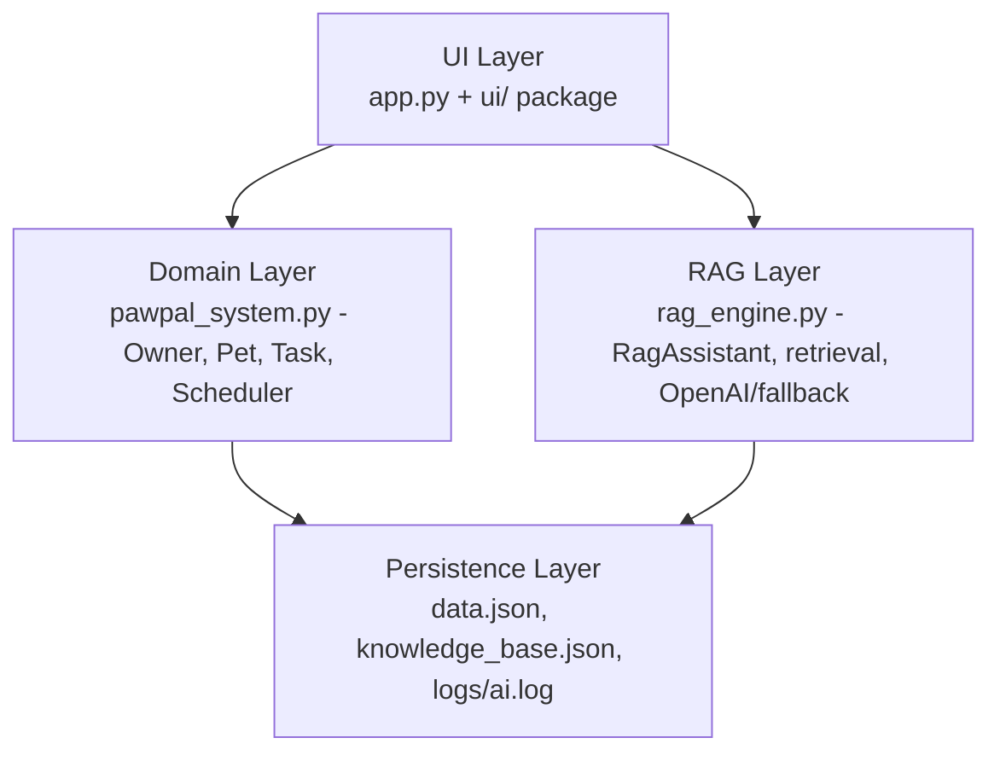
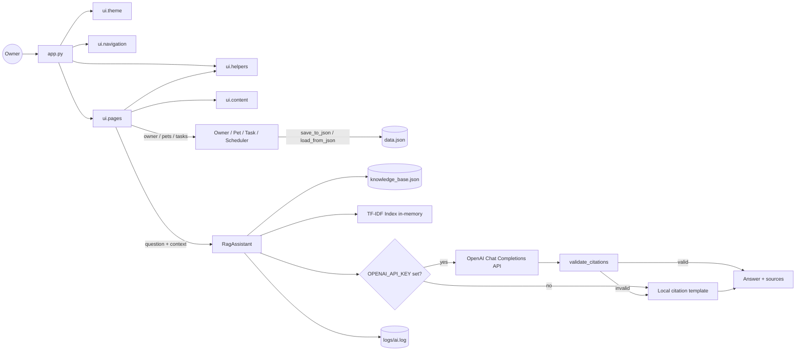
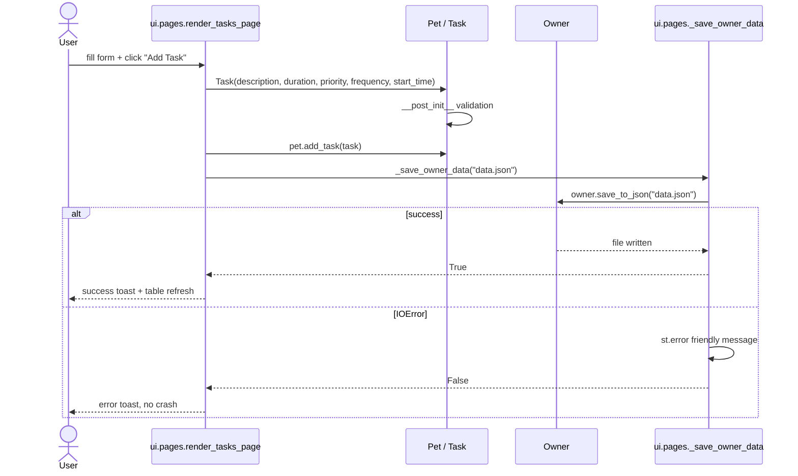
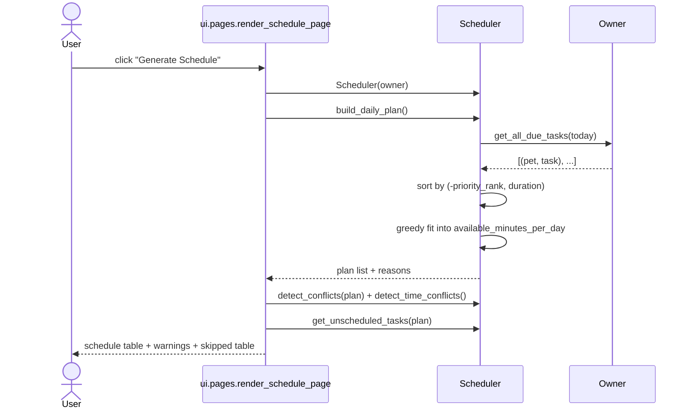
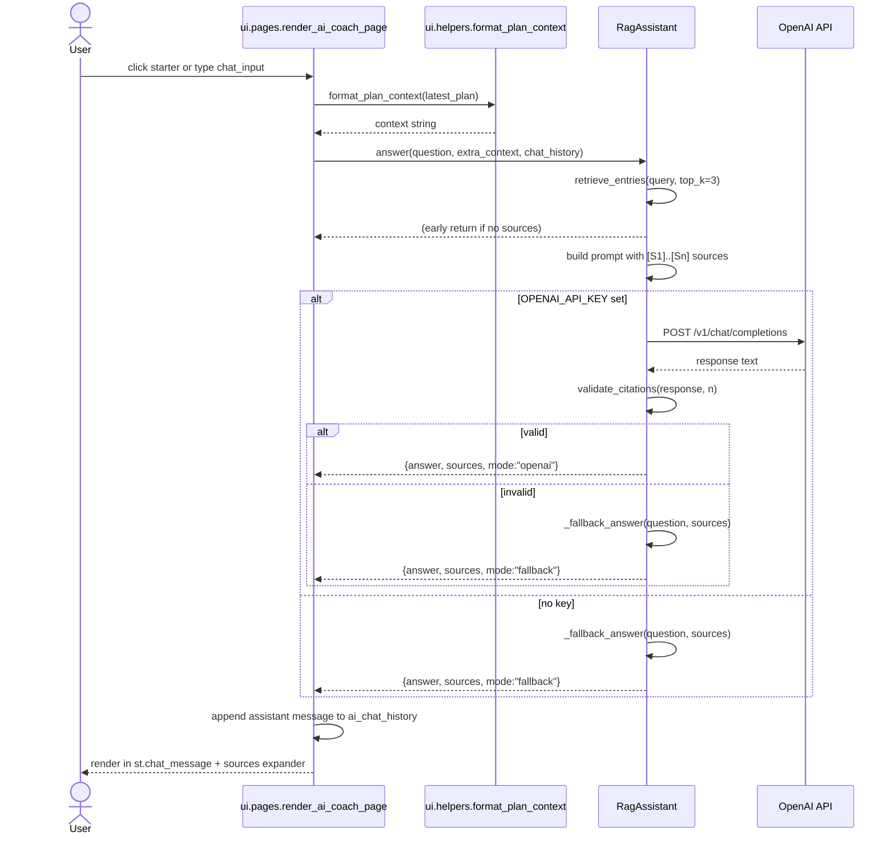
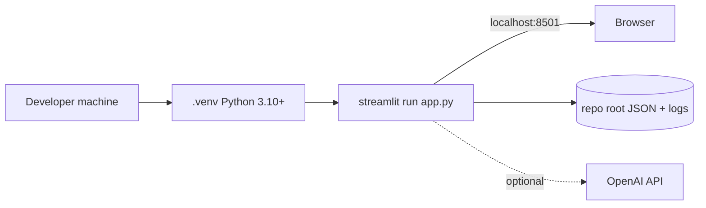

# PawPal+ — Architecture

**Purpose:** Describe the layered structure of PawPal+, where modules live, how they talk, and the rules that keep them decoupled.
**Audience:** Anyone making a non-trivial code change.
**Last updated:** 2026-04-28.
**Related docs:** [claude.md](claude.md) · [data-model.md](data-model.md) · [skills.md](skills.md) · [rag-spec.md](rag-spec.md).

---

## 1. Layers

PawPal+ is split into four well-defined layers. Lower layers know nothing about higher layers.

### 1.1 UI Layer — [app.py](../../app.py) + [ui/](../../ui/) package

The entry point [app.py](../../app.py) is intentionally thin (~93 lines). It only wires up:

- Page config + theme via [ui/theme.py](../../ui/theme.py): `apply_theme()` injects CSS, `render_hero()` paints the top banner.
- Session-state hydration: `Owner.load_from_json("data.json")`, `latest_plan`, `ai_chat_history`, `active_service`.
- Navigation via [ui/navigation.py](../../ui/navigation.py): `render_navbar()` + URL `?page=` query-param sync (`service_from_query_params`, `sync_service_query_param`).
- Sidebar metrics via [ui/helpers.py](../../ui/helpers.py): `get_app_metrics(owner)` and a `Build progress` bar driven by `ROADMAP_STATUS` from [ui/content.py](../../ui/content.py).
- Page dispatch to [ui/pages.py](../../ui/pages.py): `render_profile_page`, `render_pets_page`, `render_tasks_page`, `render_schedule_page`, `render_ai_coach_page`.

The `ui/` package owns all rendering; nothing in `ui/` talks to the network or to the persistence layer except through `Owner` and `RagAssistant` calls.

| File | Responsibility |
|------|----------------|
| [ui/__init__.py](../../ui/__init__.py) | Package marker. |
| [ui/theme.py](../../ui/theme.py) | `apply_theme()` (CSS), `render_hero()` (top banner). |
| [ui/helpers.py](../../ui/helpers.py) | Emoji maps (`PRIORITY_EMOJI`, `SPECIES_EMOJI`), `species_icon`, `task_emoji`, `get_app_metrics`, `format_plan_context`. |
| [ui/navigation.py](../../ui/navigation.py) | `NAV_ITEMS`, `normalize_service`, `service_from_query_params`, `sync_service_query_param`, `render_navbar`. |
| [ui/pages.py](../../ui/pages.py) | Five `render_*_page` functions; private `_save_owner_data` wrapper that try/excepts I/O failures. |
| [ui/content.py](../../ui/content.py) | Static copy: `RAG_SUPPORTED_QUESTIONS`, `RAG_NOT_SUPPORTED`, `RAG_GUARDRAILS`, `ROADMAP_STATUS`. |

**Forbidden in the UI layer:** scheduling math, retrieval math, hard-coded business rules. Those belong to Domain or RAG.

### 1.2 Domain Layer — [pawpal_system.py](../../pawpal_system.py)

- Pure-Python `dataclass`-based model: `Task`, `Pet`, `Owner`, `Scheduler`.
- Validation in `__post_init__` (priority enum, frequency enum, HH:MM format, positive duration).
- Recurrence (`Task.mark_complete` → `next_due_date`).
- Greedy priority-first scheduling (`Scheduler.build_daily_plan`).
- Conflict detection (`Scheduler.detect_conflicts`, `Scheduler.detect_time_conflicts`).
- Symmetric `to_dict` / `from_dict` for JSON persistence.
- **Forbidden:** importing `streamlit`, anything from `ui/`, `urllib`, `rag_engine`, or anything network-touching.

### 1.3 RAG Layer — [rag_engine.py](../../rag_engine.py)

- `RagAssistant` class with `answer(question, extra_context, chat_history)`.
- Loads [knowledge_base.json](../../knowledge_base.json) once.
- Builds a TF-IDF retrieval index in memory (`_build_index`).
- Calls OpenAI Chat Completions through `urllib.request` (no SDK dependency) when `OPENAI_API_KEY` is set.
- The system prompt explicitly asks for `[Sn]` citations and forbids medical diagnosis (vet referral).
- Falls back to a deterministic citation template (`_fallback_answer`) if the API key is missing or the response fails citation validation.
- Caches retrieval results and answers in-process (`_retrieval_cache`, `_answer_cache`).
- Logs every decision to `logs/ai.log` via the `pawpal_ai` logger.
- **Forbidden:** importing `pawpal_system` or anything from `ui/`. The RAG layer is intentionally domain-agnostic; the UI layer is the only bridge.

### 1.4 Persistence Layer — files on disk

- [data.json](../../data.json): full owner / pets / tasks tree, written by `Owner.save_to_json`.
- [knowledge_base.json](../../knowledge_base.json): static pet-care notes shipped with the repo.
- [tests/rag_eval_set.json](../../tests/rag_eval_set.json): canonical question / expected-source set used by the RAG eval tests.
- `.env`: optional file holding `OPENAI_API_KEY` — git-ignored, loaded by `_load_env_file` in [rag_engine.py](../../rag_engine.py).
- `logs/ai.log`: append-only log of RAG runtime decisions, gitignored.

---

## 2. Top-level component view

---

## 3. Key sequences

### 3.1 Adding a task and persisting state

### 3.2 Generating a daily plan

### 3.3 Asking the AI Coach a question

---

## 4. Module boundaries (dependency rules)

| From → To | Allowed? | Notes |
|-----------|----------|-------|
| `app.py` → `ui.*` | YES | Entry point composes the UI package. |
| `app.py` → `pawpal_system` | YES | Used only for `Owner.load_from_json` hydration. |
| `ui.*` → `pawpal_system` | YES | Pages drive the domain. |
| `ui.*` → `rag_engine` | YES | `render_ai_coach_page` constructs `RagAssistant`. |
| `ui.helpers` → `ui.pages` | NO | Helpers must not import pages (one-way). |
| `pawpal_system` → `ui.*` | NO | Domain is UI-free. |
| `pawpal_system` → `rag_engine` | NO | Domain is RAG-free. |
| `rag_engine` → `pawpal_system` | NO | RAG is domain-free; the UI bridges them via `extra_context`. |
| `rag_engine` → `ui.*` | NO | RAG is UI-free. |
| `tests/*` → `pawpal_system`, `rag_engine`, `models`, `ui.helpers`, `ui.navigation` | YES | Tests can import any non-page module. |
| `tests/*` → `ui.pages` | NO | Page renders are tested via Streamlit only; pure functions are factored into `ui.helpers` for testability. |
| `tests/*` → `app.py` | NO | Streamlit is hard to test directly; tests target the layer below. |

These rules are the reason features are easy to test in isolation. Breaking them is a code-review red flag.

---

## 5. Cross-cutting concerns

### 5.1 Logging
- One named logger: `pawpal_ai` ([rag_engine.py](../../rag_engine.py) `_setup_logger`).
- File handler: `logs/ai.log` (created on first import).
- Level: INFO. Decisions logged: cache hits, retrieval misses, OpenAI success, citation validation failures, fallback usage.

### 5.2 Configuration
- `.env` file at repo root, loaded by `_load_env_file` only if present.
- Environment variables consumed: `OPENAI_API_KEY`, `PAWPAL_AI_MODEL` (defaults to `gpt-4o-mini`).
- No config files inside `claude/doc/`.

### 5.3 Caching
- Streamlit auto-reruns on every interaction; `st.session_state` holds the live `Owner`, latest plan, chat history, and `active_service`.
- The active service is also encoded in the URL via `?page=tasks` (see [ui/navigation.py](../../ui/navigation.py)) so the UI is shareable / bookmarkable.
- `RagAssistant` keeps two in-process dicts: `_retrieval_cache` and `_answer_cache`. They live for the lifetime of the assistant instance, which is one Streamlit interaction (a new `RagAssistant` is constructed per question in the AI Coach tab — caching is intra-call only, not cross-session). This is acceptable for the project scale; see [risks-guardrails.md](risks-guardrails.md) for the larger-scale caveat.

### 5.4 Error handling
- All external I/O paths (OpenAI HTTP, file open, JSON parse) catch and log rather than propagate.
- Persistence failures are caught by `ui.pages._save_owner_data` and surfaced as a friendly `st.error` toast — the UI does not crash on disk-full or read-only filesystems.
- The UI catches `FileNotFoundError` for `knowledge_base.json` and falls back to a friendly error.

---

## 6. Deployment shape

PawPal+ runs as a single-process Streamlit app on the developer's laptop:

There is no Docker, no server-side database, no background worker. This is intentional for the course scope; an upgrade path is sketched in [roadmap.md](roadmap.md).
