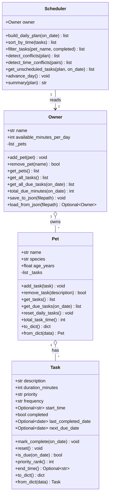

# PawPal+ — Data Model

**Purpose:** Document the in-memory class graph, the on-disk JSON schemas, and the serialization contract between them.
**Audience:** Anyone touching domain classes or persistence.
**Last updated:** 2026-04-28.
**Related docs:** [architecture.md](architecture.md) · [skills.md](skills.md) · [rag-spec.md](rag-spec.md) · [evaluation.md](evaluation.md).

---

## 1. Class diagram



Source of truth: [pawpal_system.py](../../pawpal_system.py).

### 1.1 Why no `Pet` reference on `Task`

`Task` does not store a back-pointer to its `Pet`. The system always passes `(Pet, Task)` tuples around (see `Owner.get_all_tasks`, `Owner.get_all_due_tasks`). This trade-off is documented in [reflection.md](../../reflection.md) section 1b — adding a `pet_name` field to `Task` is on the [roadmap.md](roadmap.md) wishlist.

### 1.2 Validation rules (enforced in `Task.__post_init__`)

| Field | Rule | Source |
|-------|------|--------|
| `priority` | one of `low`, `medium`, `high` | [pawpal_system.py](../../pawpal_system.py) `Task.__post_init__` |
| `frequency` | one of `daily`, `weekly`, `as_needed` | same |
| `duration_minutes` | strictly positive integer | same |
| `start_time` | None or `HH:MM` (00:00–23:59) | same |
| `Owner.available_minutes_per_day` | strictly positive integer | `Owner.__init__` |

A bad value raises `ValueError` immediately. The UI catches these in [ui/pages.py](../../ui/pages.py) `render_tasks_page` and surfaces them as `st.error` toasts.

---

## 2. JSON schema — `data.json`

Written by `Owner.save_to_json` in [pawpal_system.py](../../pawpal_system.py). Wrapped at the UI by `ui.pages._save_owner_data`, which catches I/O failures and shows a friendly error.

```json
{
  "name": "Jordan",
  "available_minutes_per_day": 120,
  "pets": [
    {
      "name": "Mochi",
      "species": "dog",
      "age_years": 2.0,
      "tasks": [
        {
          "description": "Morning walk",
          "duration_minutes": 20,
          "priority": "high",
          "frequency": "daily",
          "start_time": "08:00",
          "completed": false,
          "last_completed_date": null,
          "next_due_date": null
        }
      ]
    }
  ]
}
```

### 2.1 Field-level schema

**Owner (root object):**
| Key | Type | Required | Notes |
|-----|------|----------|-------|
| `name` | string | yes | Owner display name. |
| `available_minutes_per_day` | int > 0 | yes | Daily time budget. |
| `pets` | array of Pet | yes | May be empty. |

**Pet:**
| Key | Type | Required | Notes |
|-----|------|----------|-------|
| `name` | string | yes | Unique within an owner (UI enforces). |
| `species` | string | yes | Lowercased on input by `Pet.__post_init__`. |
| `age_years` | float ≥ 0 | yes | Default 0.0. |
| `tasks` | array of Task | yes | May be empty. |

**Task:**
| Key | Type | Required | Notes |
|-----|------|----------|-------|
| `description` | string | yes | Free text; drives emoji selection in UI. |
| `duration_minutes` | int > 0 | yes | Used by scheduler for budget math. |
| `priority` | enum | yes | `low` / `medium` / `high`. |
| `frequency` | enum | yes | `daily` / `weekly` / `as_needed`. |
| `start_time` | string or null | yes | `HH:MM` or null. |
| `completed` | bool | yes | Reset by `Pet.reset_daily_tasks` for daily tasks. |
| `last_completed_date` | ISO-8601 date string or null | yes | `YYYY-MM-DD`. |
| `next_due_date` | ISO-8601 date string or null | yes | Set by `Task.mark_complete`. |

---

## 3. JSON schema — `knowledge_base.json`

Read once by `RagAssistant.__init__` via `load_knowledge_base` in [rag_engine.py](../../rag_engine.py).

```json
[
  {
    "id": "kb_walks",
    "title": "Daily walks and exercise",
    "tags": ["dog", "walk", "exercise"],
    "content": "Most dogs benefit from at least two walks per day. Short, consistent walks reduce stress and help with digestion."
  }
]
```

### 3.1 Field-level schema

| Key | Type | Required | Notes |
|-----|------|----------|-------|
| `id` | string | yes | Stable identifier; conventionally `kb_<slug>`. Used by the eval set as `expected_kb_ids`. |
| `title` | string | yes | Becomes the source label shown in the UI. |
| `tags` | array of string | yes | Used as a +0.4 score bonus when a query token matches a tag exactly. |
| `content` | string | yes | The body that the LLM (or fallback) cites. Keep it 1–3 sentences for readability and citation density. |

### 3.2 Adding a new note

1. Append a new object with a unique `id`.
2. Pick 3–6 tags that match the kinds of questions the note answers.
3. Add at least one matching case to [tests/rag_eval_set.json](../../tests/rag_eval_set.json) (see section 4) to keep coverage at 100%.
4. Re-run `pytest tests/test_rag_eval.py`. The index is rebuilt from scratch on each `RagAssistant` instantiation — no migration step is needed.

---

## 4. JSON schema — `tests/rag_eval_set.json`

Read by [tests/test_rag_eval.py](../../tests/test_rag_eval.py). Each case is one of two kinds: an **in-scope** case (with `expected_kb_ids`) or an **out-of-scope** case (with `expected_kb_ids: []`).

```json
[
  {
    "id": "walk_freq_dog",
    "question": "How often should I walk a healthy dog?",
    "expected_kb_ids": ["kb_walks"],
    "must_contain_any": ["walk", "exercise"]
  },
  {
    "id": "oos_stock_market",
    "question": "blorf zentari quoktan",
    "expected_kb_ids": []
  }
]
```

### 4.1 Field-level schema

| Key | Type | Required | Notes |
|-----|------|----------|-------|
| `id` | string | yes | Stable case identifier. |
| `question` | string | yes | The query handed to retrieval. OOS questions use deliberate nonsense words to confirm zero matches. |
| `expected_kb_ids` | array of string | yes | The KB ids that must appear in top-3. Empty array marks an out-of-scope case. |
| `must_contain_any` | array of string | optional | Tokens that must appear (lowercase) in the deterministic fallback answer for this case. |

### 4.2 Current eval set composition

- 12 in-scope cases covering all 8 KB entries (with redundancy for `kb_walks`, `kb_feeding`, `kb_medication`, `kb_hydration`).
- 4 out-of-scope cases using random tokens to test refusal behavior.

### 4.3 Test obligations

Each case is consumed by three tests in [tests/test_rag_eval.py](../../tests/test_rag_eval.py):

1. `test_rag_eval_retrieval_at_3_and_coverage` — for in-scope cases, every `expected_kb_ids` entry must be in top-3, and overall coverage of all `expected_kb_ids` must be 100%. retrieval@3 must be ≥ 0.90.
2. `test_rag_eval_fallback_determinism_and_token_expectations` — `_fallback_answer(question, sources)` is deterministic; if `must_contain_any` is set, every token must appear in the fallback (lowercased).
3. `test_rag_eval_oos_refusal_rate` — for OOS cases, ≥ 80% must return `mode == "no_sources"`.

---

## 5. Log line schema — `logs/ai.log`

Written by the `pawpal_ai` logger ([rag_engine.py](../../rag_engine.py) `_setup_logger`).

```
2026-04-28 22:52:11,341 INFO Retrieval cache hit
2026-04-28 22:52:11,342 INFO Answered with fallback template
```

### 5.1 Format

`%(asctime)s %(levelname)s %(message)s`

### 5.2 Messages emitted

| Message | Meaning |
|---------|---------|
| `Retrieval cache hit` | The same `(question + extra_context)` was already retrieved this session. |
| `No sources matched query` | The KB did not contain any token-overlapping document; user got a "rephrase" message. |
| `Answer cache hit` | The exact prompt was already answered this session. |
| `Answered with OpenAI model` | Successful API call with valid citations. |
| `OpenAI response missing citations or failed` | API returned, but `validate_citations` rejected it. Caller fell back. |
| `Answered with fallback template` | Deterministic template path used (either no key or rejected response). |

---

## 6. Serialization contract (`to_dict` / `from_dict`)

PawPal+ uses **symmetric per-class methods** for serialization. Each class owns its own contract; `Owner` is a thin wrapper.

### 6.1 Rules

1. Every class with persisted state implements both `to_dict` and `from_dict`.
2. `from_dict` must accept a dict produced by `to_dict` and produce an equal object.
3. Date fields use `date.isoformat()` ↔ `date.fromisoformat()` (never `str(date)`).
4. `from_dict` must handle missing optional fields with `.get(key)`.
5. Public methods like `Pet.add_task` are used during reconstruction — never assign to private attributes from the outside.

### 6.2 Round-trip invariant

For any `Owner` instance `o`:

```
Owner.from_dict(o.to_dict()) == o   # equal in name, budget, pet list, task list, dates
```

This is exercised by [tests/test_pawpal.py](../../tests/test_pawpal.py) and [tests/test_models.py](../../tests/test_models.py).

### 6.3 Adding a new field

When adding a field to `Task`, `Pet`, or `Owner`:

1. Add the field to the `dataclass` (or `__init__`).
2. Add it to `to_dict` with the right serialization (ISO date, JSON-safe primitive).
3. Add it to `from_dict` with `data.get("field", default)` to stay backward-compatible with older `data.json` files.
4. Update the schema table in this file.
5. Add at least one round-trip test.

A single edit that touches `to_dict` without `from_dict` (or vice versa) is a bug.

---

## 7. Why no database

The whole project fits in three small JSON files. Adding a database would:

- Add a dependency that needs documenting in [requirements.txt](../../requirements.txt).
- Add a migration story.
- Make tests slower and harder to run on a fresh laptop.

JSON wins for the project scope. If the data ever outgrows it (multi-user, concurrent edits, > 10k tasks), see [roadmap.md](roadmap.md) for an upgrade sketch.
