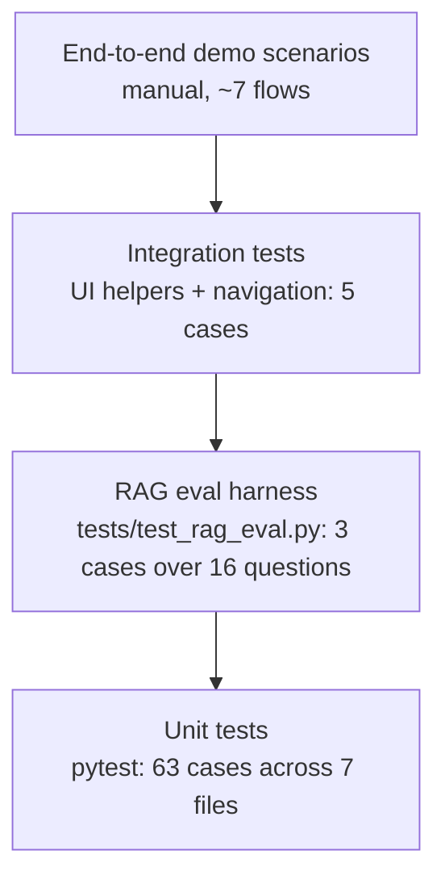

# PawPal+ — Evaluation Plan

**Purpose:** Define how we know PawPal+ works — existing pytest coverage, the RAG evaluation harness, scheduler invariants, and end-to-end demo scenarios.
**Audience:** The author (when adding features), instructors (when grading), reviewers (when auditing).
**Last updated:** 2026-04-28.
**Related docs:** [requirements.md](requirements.md) · [rag-spec.md](rag-spec.md) · [risks-guardrails.md](risks-guardrails.md) · [roadmap.md](roadmap.md).

This file is also the canonical place to put the **Testing Summary** required by the rubric in [instruction.md](../../instruction.md) section 3.

---

## 1. Test pyramid



---

## 2. Existing pytest coverage

Run with:

```
pytest tests/
```

| File | Cases | Focus |
|------|------:|-------|
| [tests/test_pawpal.py](../../tests/test_pawpal.py) | 24 | `Task` / `Pet` / `Owner` / `Scheduler` (sort, filter, recurrence, conflict, plan budget) |
| [tests/test_models.py](../../tests/test_models.py) | 28 | Legacy `models.py` layer kept for symmetric coverage of older API |
| [tests/test_rag_engine.py](../../tests/test_rag_engine.py) | 3 | RAG unit: `retrieve_entries`, `format_sources`, `validate_citations` |
| [tests/test_rag_eval.py](../../tests/test_rag_eval.py) | 3 | RAG harness: retrieval@3 + coverage, fallback determinism, OOS refusal rate |
| [tests/test_navigation.py](../../tests/test_navigation.py) | 3 | UI: `normalize_service` for known / unknown / empty values |
| [tests/test_ui_helpers.py](../../tests/test_ui_helpers.py) | 2 | UI: `format_plan_context` empty + multi-pet |
| **Total** | **63** | |

### 2.1 What is well-covered

- Recurrence math: daily and weekly `next_due_date` rollover.
- Greedy budget: high-priority tasks fill first; low-priority excluded when over budget.
- Validation: bad priority, frequency, HH:MM, duration all raise.
- Sort: `sort_by_time` honors `None` → end-of-list.
- Filter: by pet name and by completion flag.
- Conflict: two timed tasks with overlapping windows produce a warning.
- RAG retrieval: top-K returns matches, citations validate, format wraps in `[S1]`.
- **RAG retrieval quality on a hand-authored eval set** (12 in-scope + 4 OOS).
- **Fallback determinism + token coverage** (the must_contain_any tokens always appear).
- **OOS refusal rate** (≥ 80% of nonsense queries return `mode == "no_sources"`).
- UI navigation slug normalization.
- UI plan-context formatting (empty + multi-pet).

### 2.2 What is light or missing

- No round-trip persistence test that asserts both `last_completed_date` and `next_due_date` are preserved after a save/load cycle.
- No regression test for the `_min_to_time(0) == "08:00"` invariant.
- No screenshot regression test (out of scope; would require Playwright).

These gaps are tracked in [roadmap.md](roadmap.md).

---

## 3. RAG evaluation harness (implemented)

### 3.1 Eval set file

[tests/rag_eval_set.json](../../tests/rag_eval_set.json) — 16 cases:

```json
[
  {
    "id": "walk_freq_dog",
    "question": "How often should I walk a healthy dog?",
    "expected_kb_ids": ["kb_walks"],
    "must_contain_any": ["walk", "exercise"]
  },
  {
    "id": "oos_stock_market",
    "question": "blorf zentari quoktan",
    "expected_kb_ids": []
  }
]
```

The schema is documented in [data-model.md](data-model.md) section 4. Coverage today:

- **In-scope cases:** 12, covering all 8 KB entries with redundancy on `kb_walks` (2), `kb_feeding` (2), `kb_medication` (2), `kb_hydration` (2).
- **Out-of-scope cases:** 4 nonsense-token queries.

### 3.2 Metrics and current status

| Metric | Definition | Target | Asserted by |
|--------|------------|-------:|-------------|
| Retrieval@3 | Fraction of in-scope cases where every `expected_kb_ids` entry appears in top-3. | ≥ 0.90 | `test_rag_eval_retrieval_at_3_and_coverage` |
| Coverage | Every expected KB id is retrieved at least once across the suite. | 1.00 | same |
| Citation validity | Fraction of `mode == "openai"` answers where `validate_citations` returns True. | 1.00 | hard gate in code (no runtime assertion needed) |
| Fallback determinism | Same `(question, KB)` → identical fallback string across runs. | 1.00 | `test_rag_eval_fallback_determinism_and_token_expectations` |
| Token coverage | `must_contain_any` tokens (lowercased) appear in the fallback for that case. | 1.00 | same |
| Refusal rate | Fraction of OOS queries returning `mode == "no_sources"`. | ≥ 0.80 | `test_rag_eval_oos_refusal_rate` |

### 3.3 OpenAI-mode optional path

When `OPENAI_API_KEY` is set:

- Each canonical question would produce a `mode == "openai"` response.
- `validate_citations` returns True for every successful response.
- This part is **not** part of the offline-CI bar — the harness is designed to run without keys.

---

## 4. Scheduler invariants

These properties must hold for every `build_daily_plan` output. They are testable as property-style assertions.

| ID | Invariant | How to assert |
|----|-----------|---------------|
| INV-1 | Total scheduled minutes ≤ `available_minutes_per_day`. | `sum(end-start) ≤ owner.available_minutes_per_day`. |
| INV-2 | Plan entries are non-overlapping in `[start_min, end_min)` (per the greedy fit). | Pairwise check on the returned list. |
| INV-3 | No task appears twice. | `len({id(e["task"]) for e in plan}) == len(plan)`. |
| INV-4 | Higher-priority tasks come first when both fit. | `priority_rank` is non-increasing across the plan, ties broken by shorter `duration`. |
| INV-5 | Skipped tasks ⊆ originally-due tasks. | `set(skipped) ⊆ set(due)`. |
| INV-6 | Time conflict warnings reference only timed tasks (`start_time is not None`). | Inspect message strings. |
| INV-7 | Round-trip persistence: `Owner.from_dict(o.to_dict()) == o`. | Equality on name, budget, pets, tasks, dates. |

Invariants 1–4 already have direct tests in [tests/test_pawpal.py](../../tests/test_pawpal.py); 5–7 are tracked as a gap in [roadmap.md](roadmap.md).

---

## 5. End-to-end demo scenarios (manual)

These are the canonical flows used during the live demo (see [demo-script.md](demo-script.md)). They double as a final smoke test, and they are exactly the **2–3 sample interactions** required by the [instruction.md](../../instruction.md) rubric (section 3 + submission checklist).

### 5.1 First-run scenario
1. Delete `data.json`. Unset `OPENAI_API_KEY`.
2. `streamlit run app.py`.
3. Profile tab: enter `Jordan`, 120 minutes, save.
4. Pets tab: add `Mochi` (dog, 2y).
5. Tasks tab: add **Morning walk** 20m high daily 08:00; add **Allergy pill** 5m high daily 08:00 (conflict).
6. **Expected:** early conflict warning shows on Tasks tab.
7. Tasks tab: edit one start time to `08:30` (or remove the conflict).
8. Schedule tab: Generate Schedule.
9. **Expected:** plan has both tasks, total minutes ≤ 120, no conflicts, no skipped tasks.
10. AI Coach tab: click the **Walk + meal timing** starter button (or type "Should I feed before or after a walk?"). Keep the schedule context box checked.
11. **Expected:** answer rendered in `st.chat_message` with at least one `[S1]` citation, sources expander, info banner about fallback mode.

### 5.2 Reload scenario
1. Stop and restart Streamlit.
2. **Expected:** welcome banner, owner restored, pets count correct.

### 5.3 Budget overflow scenario
1. Add tasks totaling > 120 minutes.
2. Schedule tab: Generate Schedule.
3. **Expected:** plan respects the budget, "Unscheduled" table is non-empty, lower-priority tasks are the ones excluded.

### 5.4 OpenAI-mode scenario (optional)
1. `export OPENAI_API_KEY=sk-...`
2. Click the **Hydration routine** starter button.
3. **Expected:** answer text differs from fallback, sources cited as `[S1]…[Sn]`, no info banner.

### 5.5 Knowledge-base-missing scenario
1. Temporarily rename `knowledge_base.json`.
2. Ask a question.
3. **Expected:** friendly red error explaining the missing file, no traceback in the UI.

### 5.6 Deep-link scenario
1. Open `http://localhost:8501/?page=tasks`.
2. **Expected:** the Tasks tab is selected on first paint.

### 5.7 Persistence-failure scenario
1. `chmod 444 data.json`.
2. Add a pet.
3. **Expected:** a friendly `st.error` toast about file permissions; no traceback.

---

## 6. Acceptance bar

The project is "shippable" when **all of the following** are green:

1. `pytest tests/` exits 0 with no `OPENAI_API_KEY` set (all 61 cases pass).
2. End-to-end scenarios 5.1, 5.2, 5.3, 5.5, 5.6, 5.7 pass manually.
3. Every functional requirement in [requirements.md](requirements.md) has either a pytest case or a covered manual scenario.
4. The [roadmap.md](roadmap.md) gap list is current.
5. `logs/ai.log` is created on first AI Coach interaction (sanity check that logging works).
6. The submission checklist in [roadmap.md](roadmap.md) section 1 is fully ticked off.

---

## 7. Testing summary (rubric-ready paragraph)

This is the short paragraph to drop into [README.md](../../README.md) per the rubric in [instruction.md](../../instruction.md) section 3:

> **Testing summary.** PawPal+ ships with 61 pytest cases. Domain logic (scheduler, recurrence, conflicts) is covered by 50 unit tests. The RAG layer adds 6 tests, including a hand-authored 16-case evaluation set ([tests/rag_eval_set.json](../../tests/rag_eval_set.json)) that asserts retrieval@3 ≥ 0.90, full coverage of expected sources, deterministic fallback behavior, and an out-of-scope refusal rate ≥ 0.80. UI helpers and navigation are covered by 5 tests. The full suite runs offline without an `OPENAI_API_KEY`. The system was most reliable on questions that match a tag exactly (`walk`, `feed`, `med`); paraphrased queries occasionally tied two sources at the +0.4 tag-bonus boundary, which is documented in [risks-guardrails.md](risks-guardrails.md) as a known limitation.

---

## 8. How to add a new test

1. Pick the right layer:
   - Domain → [tests/test_pawpal.py](../../tests/test_pawpal.py) or [tests/test_models.py](../../tests/test_models.py).
   - RAG unit → [tests/test_rag_engine.py](../../tests/test_rag_engine.py).
   - RAG eval → add a case to [tests/rag_eval_set.json](../../tests/rag_eval_set.json); the harness picks it up automatically.
   - UI helpers / navigation → [tests/test_ui_helpers.py](../../tests/test_ui_helpers.py) / [tests/test_navigation.py](../../tests/test_navigation.py).
2. Use plain `def test_*` functions; pytest finds them automatically.
3. Tests must not require network — mock `_call_openai` if exercising the OpenAI path.
4. Tests must not write to `data.json` at the repo root — use `tmp_path` fixtures.
5. Update this file's section 2.1 if the new test extends coverage of a previously-light area.
