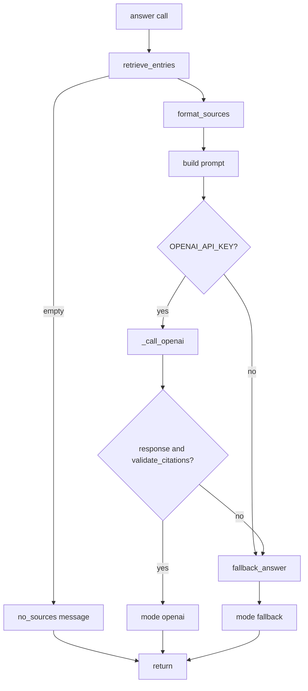
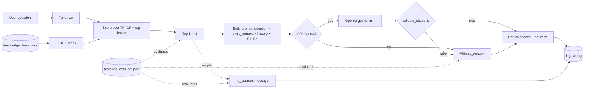

# PawPal+ — RAG Architecture Specification

**Product/Feature:** AI Coach (PawPal+ pet-care Q&A).
**Owner:** Project author.
**Status:** Production-ready (v1 shipped + evaluation harness landed).
**Purpose:** Specify the Retrieval-Augmented Generation pipeline that powers the AI Coach tab — what it retrieves, how it builds context, how it generates, how it is evaluated, and where it can fail.
**Audience:** Anyone modifying [rag_engine.py](../../rag_engine.py) or designing follow-on features.
**Last updated:** 2026-04-28.
**Related docs:** [architecture.md](architecture.md) · [skills.md](skills.md) · [requirements.md](requirements.md) · [risks-guardrails.md](risks-guardrails.md) · [evaluation.md](evaluation.md).

This file follows the 2026 RAG architecture template (IdeaPlan / Microsoft Architecture Center): Use Case → Retrieval → Context Assembly → Generation → Evaluation → Optimization → Diagram.

---

## 1. Use case definition

### 1.1 Who and why

A pet owner using PawPal+ has a natural-language question about pet care (walks, feeding, medication, grooming, enrichment, hydration, litter care, rabbit routines). They need a short, trustworthy answer that:

1. Is grounded in the local knowledge base (no hallucinated facts).
2. Cites its sources.
3. Defers to a vet for medical concerns.
4. Optionally takes today's plan into account when relevant.

### 1.2 Question types we support

The supported question list shown in the UI lives in [ui/content.py](../../ui/content.py) `RAG_SUPPORTED_QUESTIONS`:

- **Routine guidance:** walk, feed, hydration, grooming.
- **Timing questions:** before/after walk, spacing meals.
- **Care basics:** dogs, cats, and rabbits.
- **Schedule-aware suggestions** when today's plan is included.

The AI Coach also exposes three starter-prompt buttons that map to these categories: **Walk + meal timing**, **Hydration routine**, **Plan-aware advice**.

### 1.3 Question types we do NOT support

The unsupported list lives in [ui/content.py](../../ui/content.py) `RAG_NOT_SUPPORTED`:

- Veterinary diagnosis or urgent medical advice.
- Real-time external data (weather, store hours).
- Personal pet history that is not stored in PawPal+.
- Deep multi-document research beyond local notes.

These constraints are surfaced to the user in the **Question scope and guardrails** expander on the AI Coach tab.

### 1.4 Knowledge base scope

- 8 entries today in [knowledge_base.json](../../knowledge_base.json) (walks, feeding, medication, hydration, grooming, enrichment, cat litter, rabbit routine).
- Each entry is `< 300 characters` of content for citation density.
- The KB is shipped with the repo, no ingestion pipeline needed.
- An evaluation set covering all 8 entries lives at [tests/rag_eval_set.json](../../tests/rag_eval_set.json) (12 in-scope + 4 out-of-scope cases).

---

## 2. Retrieval pipeline

### 2.1 Tokenization

`_tokenize(text)` lowercases and extracts `[a-z0-9]+` tokens via a single regex in [rag_engine.py](../../rag_engine.py). This is intentionally simple — no stop-word removal, no stemming. The KB is small enough that recall trumps cleverness.

### 2.2 Index construction

Built once per `RagAssistant` instance by `_build_index` in [rag_engine.py](../../rag_engine.py).

For each KB entry the index stores:
- `tf` — term frequency map over `title + tags + content` (normalized by token count).
- `tags` — lowercased tag set (used as a signal boost during scoring).

A document-frequency map is built across all entries. The IDF is the standard smoothed form:

```
idf[token] = log((1 + N) / (1 + df[token])) + 1.0
```

where `N` is the number of KB entries.

### 2.3 Retrieval strategy

| Stage | Method | Parameters | Purpose |
|-------|--------|-----------|---------|
| 1. Tokenize query | regex `[a-z0-9]+` | — | Normalize input. |
| 2. Score | TF·IDF over `title + tags + content` | — | Initial relevance ranking. |
| 3. Tag boost | `+0.4` per query token that hits an entry tag | — | Reward exact-tag intent ("dog", "cat", "med"). |
| 4. Filter | Drop entries with `score == 0` | — | Eliminate non-matches. |
| 5. Sort + truncate | Top-K | `k = 3` | Cap context size. |

Source: `retrieve_entries` in [rag_engine.py](../../rag_engine.py).

### 2.4 Retrieval parameters

| Parameter | Value | Notes |
|-----------|-------|-------|
| `k` (top-K) | 3 | Set in `RagAssistant(kb_path, k=3)`. |
| Tag bonus | +0.4 per hit | Tunable; chosen empirically against the 8-entry KB and validated by `test_rag_eval_retrieval_at_3_and_coverage`. |
| Min score | > 0 | Anything that scores zero is dropped. |
| Re-ranking | None | Not needed at this scale; documented as future work. |
| Hybrid retrieval | Pure TF-IDF only | A keyword/full-text path is unnecessary because the index is text-only and small. |

### 2.5 Why TF-IDF instead of embeddings (v1)

- **No external dependency.** The whole retrieval path is pure-Python `re` and `math.log`. No `sentence-transformers`, no FAISS, no API costs.
- **Determinism.** TF-IDF gives stable, reproducible ranks for tests. The deterministic property is asserted by `test_rag_eval_fallback_determinism_and_token_expectations`.
- **Right-sized for 8 entries.** Switching to embeddings would not move the needle on retrieval quality at this scale, and would add a heavy install.
- **Upgrade path is documented.** [roadmap.md](roadmap.md) section 4 sketches the embeddings + hybrid + re-ranker upgrade if the KB grows past ~50 entries.

---

## 3. Context assembly

### 3.1 Source labels

Each retrieved entry is assigned a label `S1`…`Sn` in retrieval order via `format_sources` in [rag_engine.py](../../rag_engine.py). The label is what the LLM is told to cite, and what the UI renders inside each assistant chat message under "Sources used".

### 3.2 Context template (text actually sent to the LLM)

`RagAssistant.answer` in [rag_engine.py](../../rag_engine.py) builds the prompt as a series of joined sections:

```
Question: <user question>

Context:
<extra_context or 'None'>

Conversation history:
<recent 6-turn history, optional>

Sources:
[S1] Daily walks and exercise: Most dogs benefit from at least two walks...
[S2] Consistent feeding times: Feed pets at consistent times...
[S3] Hydration reminders: Ensure fresh water is available...

Answer using only the sources. Include citations like [S1].
```

### 3.3 Context assembly rules

- **Source-only answers.** The system prompt instructs the model to use only the provided sources and cite them.
- **Vet deferral baked in.** The system prompt also says: *"Do not provide medical diagnosis; advise consulting a veterinarian when symptoms or medical concerns are involved."*
- **Schedule context is opt-in.** The UI lets the user pick whether to inject `format_plan_context(latest_plan)` (default: checked).
- **History window = 6 messages.** The most recent 6 turns are joined into a `Conversation history` block. The Streamlit-side history cap is 20 messages; the prompt only ever sees the last 6.
- **No deduplication needed.** With `k = 3` and 8 entries, near-duplicates do not occur in practice.

### 3.4 Citation strategy

- Every successful LLM answer must contain at least one valid `[Sk]` token, `1 ≤ k ≤ n`.
- The fallback template guarantees this by construction (one bullet per source, each ending with `[Sk]`).
- Validated by `validate_citations` in [rag_engine.py](../../rag_engine.py).
- Failures cause a transparent fallback to the local template.

---

## 4. Generation layer

### 4.1 Model configuration

| Parameter | Value | Notes |
|-----------|-------|-------|
| Model | `gpt-4o-mini` | Default; overridable via `PAWPAL_AI_MODEL` env var. |
| Temperature | `0.2` | Low — we want grounded, citation-faithful answers. |
| Top-p | unset | Default. |
| Max output tokens | unset | Defaults to API default; KB content is short enough that responses stay short. |
| Streaming | No | Streamlit re-renders on completion via `st.rerun()`; the latency is acceptable for the project scale. |
| Stop sequences | None | |
| Timeout | 20 seconds | `urllib.request.urlopen(..., timeout=20)`. |

### 4.2 System prompt

Defined inline in `_call_openai` in [rag_engine.py](../../rag_engine.py):

> You are a pet-care assistant. Use only the provided sources and cite them as `[S1]`, `[S2]`, etc. If the sources do not cover the question, say what is missing and ask one clarifying question. Do not provide medical diagnosis; advise consulting a veterinarian when symptoms or medical concerns are involved.

This system prompt is intentionally short and rule-based. Four behaviors are encoded:

1. **Source grounding.** "Use only the provided sources."
2. **Citation discipline.** "Cite them as `[S1]`, `[S2]`, etc."
3. **Graceful refusal.** "If the sources do not cover the question, say what is missing and ask one clarifying question."
4. **Vet deferral.** "Do not provide medical diagnosis; advise consulting a veterinarian when symptoms or medical concerns are involved."

### 4.3 User prompt

Whatever `RagAssistant.answer` assembled in section 3.2.

### 4.4 Generation quality controls

- **Citation validation** (`validate_citations`) — hard gate.
- **Vet deferral** — embedded in both the system prompt (OpenAI mode) and the fallback final line ("If symptoms or medical concerns are involved, contact a veterinarian.").
- **Low temperature** — reduces creative drift.
- **Short context** — hard to over-fit.

### 4.5 Branching logic



---

## 5. Evaluation framework

The full plan is in [evaluation.md](evaluation.md). The RAG-specific summary, **all of which is implemented today** in [tests/test_rag_eval.py](../../tests/test_rag_eval.py):

### 5.1 Retrieval quality

- **Retrieval@3** — for each in-scope eval case, every `expected_kb_ids` entry must appear in the top-3. Asserted ≥ 0.90 by `test_rag_eval_retrieval_at_3_and_coverage`.
- **Coverage** — every KB entry referenced by the eval set must actually be retrieved at least once. Asserted in the same test.

### 5.2 Generation quality

- **Citation validity** — `validate_citations` returns True on every successful OpenAI answer (gated by code; not a runtime test because it would require the key).
- **Fallback determinism** — `_fallback_answer(q, sources)` returns the same string every time. Asserted by `test_rag_eval_fallback_determinism_and_token_expectations`, which also enforces that any `must_contain_any` tokens appear in the fallback.

### 5.3 Out-of-scope behavior

- **Refusal rate** — at least 80% of nonsense / out-of-scope queries must return `mode == "no_sources"`. Asserted by `test_rag_eval_oos_refusal_rate`.

### 5.4 Eval set

[tests/rag_eval_set.json](../../tests/rag_eval_set.json) currently contains:

- 12 in-scope cases covering all 8 KB entries (with redundancy on `kb_walks`, `kb_feeding`, `kb_medication`, `kb_hydration`).
- 4 out-of-scope cases using deliberately-invented tokens.

---

## 6. Production optimization

### 6.1 Caching

- **In-process retrieval cache** keyed by lowercased `"sources::" + (question + extra_context)`.
- **In-process answer cache** keyed by lowercased `"answer::" + full_prompt`.
- Lifetime: a single Streamlit interaction (one `RagAssistant` instance per question in the AI Coach tab).
- Why this is acceptable: the workload is single-user, single-session; cross-session caching adds complexity without measurable benefit at this scale.

### 6.2 Cost

- TF-IDF index: built in O(N · L) once per `RagAssistant`; trivial at N=8, L<300 chars.
- LLM call: one round-trip per question (only when key is set and cache misses).
- Default model `gpt-4o-mini` — cheapest reasonable choice.

### 6.3 Monitoring

All decisions go to `logs/ai.log` via the `pawpal_ai` logger. The set of messages is enumerated in [data-model.md](data-model.md) section 5.2.

### 6.4 Future optimization (not in v1 scope)

- Streaming responses for perceived latency.
- Persistent semantic cache keyed by query embedding.
- Hybrid retrieval (BM25 + vectors) when KB > 50 entries.
- Cross-encoder re-ranker on top-10 → top-3.
- These ideas are tracked as the **RAG enhancement** stretch feature in [roadmap.md](roadmap.md) section 4.

---

## 7. Architecture diagram



---

## 8. Key takeaways

1. The RAG layer is **deliberately small and deterministic** so that tests pass without an API key and the fallback is meaningful.
2. **Citations are a hard gate.** A non-citing response is treated as a failure, not a quirk.
3. **Vet deferral is in the system prompt** (not just the fallback) — both LLM-mode and fallback-mode responses defer to a vet on medical concerns.
4. **Schedule-awareness is a free upgrade** — the UI passes the plan as `extra_context`, no changes to the RAG core needed.
5. **The eval harness is a first-class deliverable** — it lives next to unit tests, runs without an API key, and is the evidence for the rubric's reliability requirement.
6. The pipeline is wired in such a way that **upgrading retrieval (TF-IDF → embeddings) leaves the rest of the system unchanged**.
