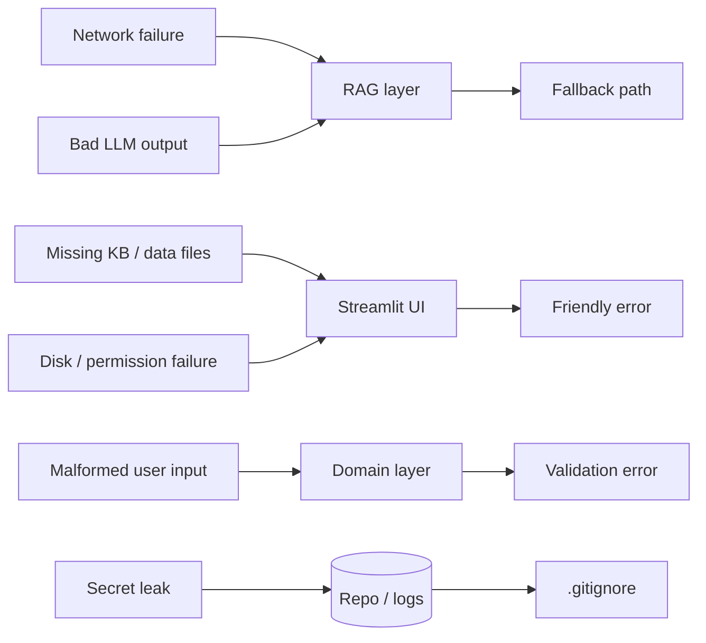

# PawPal+ — Risks and Guardrails

**Purpose:** Catalog the failure modes PawPal+ must handle, the guardrails already in place, and the known limitations that are accepted trade-offs at this scope.
**Audience:** Anyone reasoning about reliability, safety, or how the system degrades.
**Last updated:** 2026-04-28.
**Related docs:** [architecture.md](architecture.md) · [rag-spec.md](rag-spec.md) · [evaluation.md](evaluation.md) · [roadmap.md](roadmap.md).

This file is also the source for the **Reflection / Ethics** section of the upcoming `model_card.md` deliverable required by the [instruction.md](../../instruction.md) submission checklist.

---

## 1. Threat / failure model summary

Each arrow has a documented guardrail below.

---

## 2. AI / RAG guardrails (in place today)

### 2.1 Citation enforcement
**Risk:** The LLM produces a confident answer with no source attribution; the user trusts unverifiable claims.
**Guardrail:** `validate_citations(answer, n)` in [rag_engine.py](../../rag_engine.py) is a hard gate. Every successful OpenAI response must contain at least one `[Sk]` token with `1 ≤ k ≤ n`. Failures emit a log line and trigger the fallback.
**Status:** Active.

### 2.2 Deterministic fallback
**Risk:** No API key, network outage, or unparseable response leaves the user stranded.
**Guardrail:** `_fallback_answer` in [rag_engine.py](../../rag_engine.py) builds a deterministic, citation-faithful response from the retrieved sources. It always ends with the vet disclaimer. Determinism is asserted by `test_rag_eval_fallback_determinism_and_token_expectations`.
**Status:** Active.

### 2.3 Vet deferral (system prompt + fallback)
**Risk:** The system gives medical advice it has no business giving.
**Guardrail (OpenAI mode):** The system prompt in `_call_openai` says: *"Do not provide medical diagnosis; advise consulting a veterinarian when symptoms or medical concerns are involved."*
**Guardrail (fallback mode):** Every fallback answer ends with: *"If symptoms or medical concerns are involved, contact a veterinarian."*
**Status:** Active in both modes.

### 2.4 Source-only generation prompt
**Risk:** The model invents pet-care facts not present in the KB.
**Guardrail:** System prompt: *"Use only the provided sources and cite them as `[S1]`, `[S2]`, etc. If the sources do not cover the question, say what is missing and ask one clarifying question."*
**Status:** Active.

### 2.5 Empty-retrieval transparent refusal
**Risk:** The model fabricates an answer when retrieval finds nothing.
**Guardrail:** `RagAssistant.answer` short-circuits when `sources == []`, returning `mode == "no_sources"` and a "rephrase" message. Asserted by `test_rag_eval_oos_refusal_rate` to fire on ≥ 80% of nonsense queries.
**Status:** Active.

### 2.6 Network failure containment
**Risk:** An outbound HTTPS error crashes the Streamlit page.
**Guardrail:** `_call_openai` catches `HTTPError`, `URLError`, `KeyError`, `ValueError` and returns `None`. The caller falls back. Timeout is set to 20 seconds.
**Status:** Active.

### 2.7 User-visible scope and guardrails
**Risk:** The user does not know what the AI Coach can / cannot answer or what protections are in place.
**Guardrail:** The AI Coach tab includes a **Question scope and guardrails** expander listing supported question types, unsupported types, and active guardrails (sourced from [ui/content.py](../../ui/content.py)).
**Status:** Active.

---

## 3. Application robustness guardrails

### 3.1 Missing knowledge base
**Risk:** Someone deletes `knowledge_base.json`; the AI Coach tab crashes.
**Guardrail:** UI catches `FileNotFoundError` in `render_ai_coach_page` and shows a single-line error.
**Status:** Active.

### 3.2 Generic AI Coach exception
**Risk:** Any other unexpected exception crashes the page.
**Guardrail:** A bare `except Exception` shows a friendly red error pointing to `logs/ai.log`, then `return`s.
**Status:** Active.

### 3.3 Bad user input
**Risk:** A user types `priority="urgent"` or `start_time="9am"`.
**Guardrail:** `Task.__post_init__` validates priority enum, frequency enum, HH:MM regex, and positive duration. The UI catches `ValueError` and shows it inline.
**Status:** Active.

### 3.4 Duplicate pet names
**Risk:** Adding two pets named "Mochi" causes selection ambiguity in the Tasks tab.
**Guardrail:** UI checks `existing_names` before calling `Owner.add_pet`.
**Status:** Active. Domain-level uniqueness is enforced at the UI; the domain itself does not enforce it.

### 3.5 Persistence failure
**Risk:** `Owner.save_to_json` fails to write (disk full, read-only filesystem, permission denied).
**Guardrail:** `ui.pages._save_owner_data` wraps the call in a try/except, returns a boolean, and shows a friendly `st.error` on failure. The UI does not crash.
**Status:** Active.

### 3.6 Schema drift on `data.json`
**Risk:** A new field is added to `Task`; an old `data.json` is missing it; load crashes.
**Guardrail:** `from_dict` uses `data.get("field")` with sensible defaults — see [data-model.md](data-model.md) section 6.3.
**Status:** Active when the rule is followed; reviewable in code review.

### 3.7 Unknown navigation slug
**Risk:** A user shares `?page=blog` and the app crashes.
**Guardrail:** `normalize_service` and `service_from_query_params` in [ui/navigation.py](../../ui/navigation.py) silently fall back to the default service. Asserted by [tests/test_navigation.py](../../tests/test_navigation.py).
**Status:** Active.

---

## 4. Secrets and privacy

### 4.1 API key handling
**Risk:** `OPENAI_API_KEY` is committed to the repo.
**Guardrail:**
- `.env` is git-ignored ([.gitignore](../../.gitignore)).
- `_load_env_file` reads `.env` only if present, never overwrites pre-set env vars.
- The README documents the variable.
**Status:** Active.

### 4.2 PII in logs
**Risk:** `logs/ai.log` could log questions that contain personal information.
**Guardrail:** Today the logger only logs decision metadata (cache hit, mode, validation result), **not** the user's question text. This is intentional. Anyone changing log statements must keep this property.
**Status:** Active by convention. Documented here to prevent regression.

### 4.3 No data ever leaves the laptop except via the LLM call
**Risk:** Telemetry, analytics, or third-party calls leak owner/pet data.
**Guardrail:** The only outbound network destination is `https://api.openai.com/v1/chat/completions`. Domain logic and persistence are local-only.
**Status:** Active. Verified by inspection of [rag_engine.py](../../rag_engine.py) — the only `urllib.request.Request` call is to `OPENAI_URL`.

---

## 5. Misuse considerations (rubric §5)

The [instruction.md](../../instruction.md) rubric asks: *"Could your AI be misused, and how would you prevent that?"* Answers below are summarized for the model card.

| Misuse | Mitigation |
|--------|------------|
| Asking for a medication dose or vet diagnosis | System prompt forbids medical diagnosis; fallback answer always defers to a vet. |
| Asking about an unsupported topic and trusting the answer | Empty-retrieval refusal returns `mode == "no_sources"`; supported / unsupported lists are visible in the UI expander. |
| Sharing a deep-linked schedule that exposes private pet data | The URL only encodes the active service slug, never owner / pet content. |
| Pasting a malicious prompt that tries to override the system | Citations are gated; if the model does not cite, the fallback runs and the user sees a deterministic local answer. |
| Persisting bad data to `data.json` that crashes a teammate's app | All validators are in `__post_init__`; `from_dict` uses defensive `.get()`. |

---

## 6. Known limitations (accepted at this scope)

These are **acknowledged trade-offs**, not bugs. They are documented so reviewers do not flag them as defects.

### 6.1 Greedy scheduler is not optimal
The scheduler is greedy and never backtracks. A high-priority task that consumes most of the budget can starve smaller tasks that would have collectively delivered more value. Intentional — see [reflection.md](../../reflection.md) section 2b. Optimal scheduling is on the wishlist in [roadmap.md](roadmap.md).

### 6.2 O(n²) conflict detection
Both `detect_conflicts(plan)` and `detect_time_conflicts()` do pairwise comparison. At realistic task counts (≤ 30) the cost is invisible; at larger scales an interval-tree approach would be better.

### 6.3 No back-pointer from `Task` to `Pet`
A standalone `Task` does not know which `Pet` it belongs to; the system passes `(Pet, Task)` tuples everywhere. See [data-model.md](data-model.md) section 1.1.

### 6.4 In-process RAG cache only
`_retrieval_cache` and `_answer_cache` live for a single Streamlit interaction. Cross-session caching would require a persistent store; see [rag-spec.md](rag-spec.md) section 6.4.

### 6.5 TF-IDF retrieval, not embeddings
TF-IDF is sufficient for an 8-entry KB. As soon as the KB grows past ~50 entries or tackles paraphrased queries, embeddings + a hybrid path become worthwhile. See [rag-spec.md](rag-spec.md) section 2.5.

### 6.6 Single user, single laptop
No auth, no concurrent edits, no cloud sync. Adding any of these is out of scope for this project.

### 6.7 KB bias toward dogs
The KB has more dog-leaning content than cat / rabbit content (3 dog-tagged entries, 1 cat-litter entry, 1 rabbit entry). Retrieval@3 on rabbit-only queries is more sensitive to phrasing.

---

## 7. Open gaps (tracked in roadmap)

These gaps are **not yet covered** and are tracked in [roadmap.md](roadmap.md):

1. Round-trip persistence test covering all date fields.
2. Optional: log rotation policy on `logs/ai.log` (currently grows unbounded).
3. Optional: PNG export of the architecture diagram into `assets/` for the submission package.
4. Optional: `model_card.md` at repo root (required for submission).

---

## 8. Incident playbook (lightweight)

If a user reports something off:

1. **AI says something wrong.** Check `logs/ai.log` for the mode (`openai` / `fallback` / `no_sources`). If `mode == "openai"`, copy the prompt from logs and re-run with the same KB; if it still misfires, lower temperature or tighten the system prompt.
2. **App crashes on launch.** Most likely a corrupt `data.json`. Move it aside; the app starts fresh. The user can re-add their pets.
3. **AI Coach silently uses fallback.** Check `OPENAI_API_KEY` is exported in the same shell that started Streamlit (Streamlit does not pick up env changes after launch).
4. **Conflict warning seems wrong.** `detect_time_conflicts` does not know that two pets can be cared for in parallel by two humans. This is a documented limitation in [reflection.md](../../reflection.md) section 4b.
5. **Save shows an error toast.** Check filesystem permissions on `data.json` and the working directory. The `_save_owner_data` wrapper already prevents a crash.
