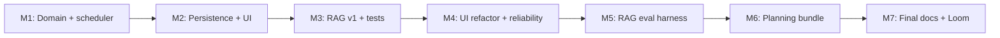

# PawPal+ — Roadmap

**Purpose:** Track what is done, what is in flight, what remains for the final-project bar (per [instruction.md](../../instruction.md)), and the stretch-goal wishlist.
**Audience:** The author (planning the next session), instructors (grading progress), reviewers (auditing scope).
**Last updated:** 2026-04-28.
**Related docs:** [requirements.md](requirements.md) · [evaluation.md](evaluation.md) · [risks-guardrails.md](risks-guardrails.md) · [demo-script.md](demo-script.md).

---

## 1. Submission checklist (rubric trace)

Every line below traces a [instruction.md](../../instruction.md) requirement to the deliverable that satisfies it. This is the canonical "is the project ready to submit" view.

### 1.1 Required deliverables

| # | Rubric requirement (from [instruction.md](../../instruction.md)) | Status | Where it lives |
|---|------------------------------------------------------------------|--------|----------------|
| 1 | Identify base project (Module 1–3) and 2–3 sentence summary | DONE | [README.md](../../README.md) **Base project** + **What changed** |
| 2 | Title + summary | DONE | [README.md](../../README.md) lead + scenario |
| 3 | Architecture overview + system diagram | DONE ([`claude/doc/architecture.md`](claude/doc/architecture.md) Mermaid; optional PNGs under `assets/`) | [architecture.md](architecture.md), [`assets/`](../../assets/) |
| 4 | Setup instructions | DONE | [README.md](../../README.md) "Getting started" |
| 5 | Sample interactions (2–3 inputs + outputs) | DONE | [README.md](../../README.md) **Sample interactions (AI Coach)** |
| 6 | Design decisions + trade-offs | DONE | [README.md](../../README.md); [reflection.md](../../reflection.md); [roadmap.md](roadmap.md) §5 |
| 7 | Testing summary | DONE | [evaluation.md](evaluation.md) §7 (drop-in paragraph) |
| 8 | Reflection (limits, misuse, surprises, AI collaboration) | DONE | [README.md](../../README.md) **Reflection**; [model_card.md](../../model_card.md) |
| 9 | Functional code | DONE | [app.py](../../app.py), [pawpal_system.py](../../pawpal_system.py), [rag_engine.py](../../rag_engine.py), [ui/](../../ui/) |
| 10 | Required AI feature: RAG | DONE | [rag_engine.py](../../rag_engine.py), [rag-spec.md](rag-spec.md) |
| 11 | Reliability / testing system | DONE | [tests/test_rag_eval.py](../../tests/test_rag_eval.py), `logs/ai.log` |
| 12 | Logging or guardrails | DONE | `logs/ai.log`, [risks-guardrails.md](risks-guardrails.md) |
| 13 | Reproducibility (`pip install -r requirements.txt` works) | DONE | [requirements.txt](../../requirements.txt) |
| 14 | `model_card.md` for reflection prompts | DONE | [model_card.md](../../model_card.md) |
| 15 | System architecture diagram (image or embedded Mermaid) | DONE (Mermaid in docs; PNG in `assets/` optional) | [architecture.md](architecture.md), [`assets/`](../../assets/) |
| 16 | Loom video walkthrough link in README | TODO | record after final code freeze; embed in [README.md](../../README.md) |
| 17 | Organized assets in `/assets` or `/diagrams` | DONE (`assets/`; author adds images) | [`assets/`](../../assets/) |
| 18 | Multiple meaningful commits in git history | DONE | git log |
| 19 | Public repo on GitHub | TODO (verify) | repo settings |

### 1.2 Optional stretch features (rubric "Optional Stretch Features for Extra Points")

Each is worth +2 points. Considered features:

| # | Stretch | Status | Notes |
|---|---------|--------|-------|
| S1 | RAG enhancement (multi-source / metadata filter) | Considered | Could add a tag-filter to retrieval, or extend KB to include species-specific notes. Tracked in §4.1. |
| S2 | Agentic workflow with observable steps | Out of scope | Would require an agent loop; orthogonal to current design. |
| S3 | Fine-tuning / specialization | Out of scope | Not aligned with the offline-first design. |
| S4 | Test harness or evaluation script | Considered | A `python -m tests.run_eval` style CLI that prints retrieval@3 / refusal-rate / determinism summary. Tracked in §4.2. |

---

## 2. Project status snapshot

| Area | Status |
|------|--------|
| Domain model (Task / Pet / Owner / Scheduler) | Done |
| Persistence (`save_to_json` / `load_from_json`) | Done |
| Persistence error handling at the UI | Done |
| Streamlit UI refactored into the [ui/](../../ui/) package | Done |
| Deep-link `?page=` URL navigation | Done |
| RAG v1 (TF-IDF + OpenAI/fallback + citations) | Done |
| Vet disclaimer in OpenAI system prompt | Done |
| RAG evaluation harness ([tests/test_rag_eval.py](../../tests/test_rag_eval.py)) | Done |
| Pytest suite (63 cases) | Done |
| `claude/doc/` planning bundle | Done (this folder) |
| Final README rewrite (portfolio sections) | Done |
| `model_card.md` | Done |
| Screenshots / diagram PNGs in `assets/` | Author-managed |
| Loom recording | TODO |

The Module 2 → Final-project transition is mostly code-complete; the remaining work is documentation polish + recording.

---

## 3. Milestones

### M1 — Domain and scheduler — DONE
- `Task` / `Pet` / `Owner` / `Scheduler` classes built as dataclasses where appropriate.
- Validation in `__post_init__`.
- Greedy `build_daily_plan`, `detect_time_conflicts`, `sort_by_time`, `filter_tasks`, `get_unscheduled_tasks`, recurrence math.
- Output: [pawpal_system.py](../../pawpal_system.py), [tests/test_pawpal.py](../../tests/test_pawpal.py).

### M2 — Persistence and UI — DONE
- `to_dict` / `from_dict` symmetric pair on each persisted class.
- `Owner.save_to_json` / `Owner.load_from_json`.
- Streamlit five-tab service nav, sidebar metrics, emoji decoration.
- Output: [app.py](../../app.py), [data.json](../../data.json).

### M3 — RAG v1 and tests — DONE
- TF-IDF index over `knowledge_base.json`.
- `RagAssistant.answer` with `[Sn]` citations and OpenAI/fallback modes.
- `validate_citations` guardrail.
- Output: [rag_engine.py](../../rag_engine.py), [tests/test_rag_engine.py](../../tests/test_rag_engine.py), [knowledge_base.json](../../knowledge_base.json).

### M4 — UI refactor and reliability — DONE
- Refactored `app.py` from ~430 lines → 93 lines.
- Created the [ui/](../../ui/) package: `theme.py`, `helpers.py`, `navigation.py`, `pages.py`, `content.py`.
- Added `_save_owner_data` wrapper that catches I/O failures.
- Added vet-deferral line to the OpenAI system prompt.
- Added query-param URL sync (`?page=`).
- Added native Streamlit chat UI (`st.chat_input`, `st.chat_message`).
- Added starter-prompt buttons in the AI Coach tab.
- Added supported / unsupported / guardrails copy in [ui/content.py](../../ui/content.py).
- Added [tests/test_ui_helpers.py](../../tests/test_ui_helpers.py), [tests/test_navigation.py](../../tests/test_navigation.py).

### M5 — RAG evaluation harness — DONE
- Authored [tests/rag_eval_set.json](../../tests/rag_eval_set.json) (12 in-scope + 4 OOS).
- Implemented [tests/test_rag_eval.py](../../tests/test_rag_eval.py) with 3 assertions: retrieval@3 + coverage, fallback determinism + token coverage, OOS refusal rate.
- Documented in [evaluation.md](evaluation.md) §3 and [rag-spec.md](rag-spec.md) §5.

### M6 — Planning bundle (this folder) — DONE
- 11 spec / planning markdown files in `claude/doc/`.
- Architecture, data model, requirements, RAG spec, skills catalog, eval plan, risks, roadmap, demo script.

### M7 — Final docs and Loom — in progress

**Author-maintained:** Add or refresh screenshots and any exported diagram PNGs under [`assets/`](../../assets/); diagrams are defined in Markdown/Mermaid anyway ([`architecture.md`](architecture.md)).

- [x] Final-project framing in [`README.md`](../../README.md) (base project, interactions, testing, reflection pointer).
- [x] [`model_card.md`](../../model_card.md) with rubric §5 prompts.
- [ ] Add your own **`assets/`** images when you finalize the submission — see [`assets/`](../../assets/).
- [ ] Record the Loom walkthrough following [`demo-script.md`](demo-script.md); add URL to [`README.md`](../../README.md).
- [ ] Verify repo is public and push final commits.

---

## 4. Stretch goals (out of scope but in consideration)

These are wishlist items that would meaningfully improve the project but are **not** required for the final-project bar.

### 4.1 RAG enhancement (rubric stretch +2)
- Add a metadata / tag filter to retrieval (`retrieve_entries(query, entries, k=3, must_have_tag="cat")`).
- Or extend the KB with an additional set of species-specific notes (sourced from a vet-association FAQ) and show a measurable improvement in retrieval@3 on the new entries.
- Document the before/after numbers in [evaluation.md](evaluation.md) §3.

### 4.2 Test harness or evaluation script (rubric stretch +2)
- Build `python -m tests.run_eval` (or `scripts/run_eval.py`) that prints a summary block:
  - retrieval@3
  - coverage of expected ids
  - OOS refusal rate
  - fallback determinism
  - average sources returned
- Read directly from [tests/rag_eval_set.json](../../tests/rag_eval_set.json) so the same numbers feed the README and the pytest suite.

### 4.3 Embeddings + hybrid retrieval
- Replace TF-IDF with `sentence-transformers/all-MiniLM-L6-v2` embeddings.
- Add a BM25 keyword path; fuse with reciprocal-rank-fusion.
- Add a cross-encoder re-ranker on top-10 → top-3.
- See [rag-spec.md](rag-spec.md) §6.4.

### 4.4 Streaming responses
- Stream OpenAI tokens into the Streamlit chat for perceived latency.
- Requires switching from `urllib.request` to `httpx` or `requests` with `stream=True`.

### 4.5 `pet_name` field on `Task`
- Add a back-pointer so a standalone `Task` knows its pet.
- See [reflection.md](../../reflection.md) §5b.

### 4.6 Task editing in the UI
- Today, tasks can be added but not edited or deleted from the UI. The CLI demo handles deletion via `Pet.remove_task`. Surface this in the Tasks tab.

### 4.7 Calendar export
- Generate an `.ics` file from `latest_plan` so the schedule can be imported into Google/Apple Calendar.

### 4.8 Plan-aware AI Coach prompt pre-fills
- The third starter button already does this for "best feeding window". Add more prompts that interrogate the schedule directly.

### 4.9 Multi-day planning
- Today the scheduler plans one day at a time. Extend `build_daily_plan` to take a date range and produce a week view.

---

## 5. Decision log (high-level)

Decisions worth recording so future contributors do not re-litigate them.

| Date | Decision | Why |
|------|----------|-----|
| 2026-04 | Use TF-IDF, not embeddings | KB has 8 entries; zero new dependencies; deterministic for tests. |
| 2026-04 | Fall back to local template instead of erroring | Project runs offline by default; demo works without an API key. |
| 2026-04 | Greedy scheduler instead of optimal | Easy to explain ("highest priority first"); fast enough at the project scale. |
| 2026-04 | Symmetric `to_dict` / `from_dict` per class | Encapsulation; no class reaches into another's privates. See [reflection.md](../../reflection.md) §6. |
| 2026-04 | No vector DB, no `openai` SDK | Keeps `requirements.txt` to two lines and the install fast. |
| 2026-04 | Plan / spec docs in `claude/doc/`, not in repo root | Keeps repo root focused on running code; instructors and AI agents read one folder. |
| 2026-04 | Refactor `app.py` into a `ui/` package | The original `app.py` was ~430 lines; splitting into `theme / helpers / navigation / pages / content` made each piece testable in isolation and reduced merge friction. |
| 2026-04 | Native `st.chat_input` + `st.chat_message` | Better UX than form-style input; sources are rendered inside each assistant message. |
| 2026-04 | Cap chat history at 20 entries (10 turns) | Streamlit performance + LLM context budget; the prompt itself only ever sees the last 6 (turns to keep). |
| 2026-04 | Bake vet deferral into the system prompt | Two-layer protection (prompt + fallback). The earlier code only had the fallback line. |
| 2026-04 | Author RAG eval set as JSON, not Python | Easier to extend; consumed by both pytest and a future CLI harness. |

---

## 6. How to update this roadmap

- When a TODO item ships, change its status to DONE and move it under the relevant milestone.
- When a new gap is discovered, add it to §1 (rubric trace) or §4 (stretch).
- When a stretch goal becomes in-scope, move it into a milestone with concrete acceptance criteria.
- When a major design choice is made, append a row to the decision log.
