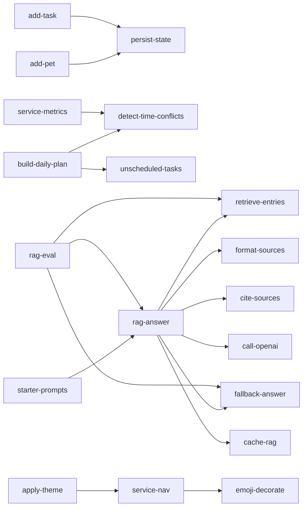

# PawPal+ — Capability Catalog ("Skills")

**Purpose:** Document every capability the system exposes as a self-contained contract — name, trigger, inputs, outputs, dependencies, failure mode.
**Audience:** Anyone implementing, testing, demoing, or reusing a feature.
**Last updated:** 2026-04-28.
**Related docs:** [requirements.md](requirements.md) · [architecture.md](architecture.md) · [data-model.md](data-model.md) · [rag-spec.md](rag-spec.md).

---

## 0. What is a "skill" here?

In this project a **skill** is a single, externally-meaningful capability of the system, expressed as a contract. Each skill has:

- **ID / name** — stable kebab-case identifier.
- **Trigger** — what user action or code path invokes it.
- **Inputs** — what it reads (state, params, files, network).
- **Outputs** — what it produces (mutated state, return value, side effects, UI render).
- **Dependencies** — other skills it relies on.
- **Failure mode** — what happens when something goes wrong.
- **Source** — concrete file that implements it.

Every skill below maps directly to a function or class method in the codebase. The catalog is the public surface of PawPal+.

---

## 1. Domain skills

### 1.1 `add-pet`
| Attribute | Value |
|-----------|-------|
| Trigger | User clicks **Add Pet** in the Pets tab. |
| Inputs | `name: str`, `species: str`, `age_years: float`. |
| Outputs | New `Pet` appended to `Owner._pets`; `data.json` auto-saved; success toast. |
| Dependencies | `persist-state`. |
| Failure mode | Duplicate `name` (case-insensitive) shows a warning toast and aborts. |
| Source | [ui/pages.py](../../ui/pages.py) `render_pets_page` → `Owner.add_pet` in [pawpal_system.py](../../pawpal_system.py). |

### 1.2 `add-task`
| Attribute | Value |
|-----------|-------|
| Trigger | User clicks **Add Task** in the Tasks tab. |
| Inputs | `description, duration_minutes, priority, frequency, start_time` for a chosen pet. |
| Outputs | New `Task` appended to `Pet._tasks`; `data.json` auto-saved; success toast. |
| Dependencies | `persist-state`. |
| Failure mode | `Task.__post_init__` raises `ValueError` for bad priority / frequency / start_time / duration; UI surfaces it as `st.error`. |
| Source | [ui/pages.py](../../ui/pages.py) `render_tasks_page` → `Task.__post_init__` in [pawpal_system.py](../../pawpal_system.py). |

### 1.3 `recurring-task`
| Attribute | Value |
|-----------|-------|
| Trigger | `Task.mark_complete(on_date)` is called (CLI demo or future UI button). |
| Inputs | Optional `on_date` (default `date.today()`). |
| Outputs | `task.completed = True`, `task.last_completed_date` set, `task.next_due_date` set to +1 day (daily) or +7 days (weekly); `as_needed` does not roll forward. |
| Dependencies | None. |
| Failure mode | None — operates on local state only. |
| Source | `Task.mark_complete`, `Task.is_due` in [pawpal_system.py](../../pawpal_system.py). |

### 1.4 `sort-by-time`
| Attribute | Value |
|-----------|-------|
| Trigger | UI sorts the Tasks tab table; CLI demo calls it directly. |
| Inputs | `tasks: list[Task]`. |
| Outputs | New list sorted by `start_time` ascending; `None`-time tasks sort to end via the `"99:99"` sentinel. |
| Dependencies | None. |
| Failure mode | Stable: `None` is normalized inside the lambda key. |
| Source | `Scheduler.sort_by_time` in [pawpal_system.py](../../pawpal_system.py). |

### 1.5 `filter-tasks`
| Attribute | Value |
|-----------|-------|
| Trigger | CLI demo and tests; not yet wired into the UI. |
| Inputs | Optional `pet_name: str`, optional `completed: bool`. |
| Outputs | Filtered list of `(Pet, Task)` tuples. |
| Dependencies | `Owner.get_all_tasks`. |
| Failure mode | None — filtering by missing pet name returns an empty list. |
| Source | `Scheduler.filter_tasks` in [pawpal_system.py](../../pawpal_system.py). |

### 1.6 `build-daily-plan`
| Attribute | Value |
|-----------|-------|
| Trigger | User clicks **Generate Schedule**. |
| Inputs | Optional `on_date` (default today); reads `Owner.available_minutes_per_day` and the full `(Pet, Task)` list. |
| Outputs | List of plan entries: `{pet, task, start_min, end_min, reason}`. |
| Dependencies | `Owner.get_all_due_tasks`, `Task.priority_rank`. |
| Failure mode | Returns `[]` when no tasks are due — UI shows a warning instead of a crash. |
| Source | `Scheduler.build_daily_plan` in [pawpal_system.py](../../pawpal_system.py). |
| Algorithm | Sort by `(-priority_rank, duration_minutes)`, then greedy fit into the time budget. |

### 1.7 `detect-time-conflicts`
| Attribute | Value |
|-----------|-------|
| Trigger | Tasks tab (early warning) and Schedule tab (post-plan). |
| Inputs | Optional list of `(Pet, Task)` pairs; defaults to all tasks. |
| Outputs | List of human-readable warning strings. Empty list if no overlaps. |
| Dependencies | None. |
| Failure mode | Soft: returns warnings, never raises, never auto-resolves. |
| Source | `Scheduler.detect_time_conflicts` in [pawpal_system.py](../../pawpal_system.py). |
| Notes | The companion `Scheduler.detect_conflicts(plan)` checks plan-level overlaps after greedy assignment; both are surfaced in the UI. |

### 1.8 `unscheduled-tasks`
| Attribute | Value |
|-----------|-------|
| Trigger | Schedule tab, after `build-daily-plan`. |
| Inputs | The plan returned by `build_daily_plan`, optional `on_date`. |
| Outputs | List of `(Pet, Task)` pairs that were due but excluded from the plan due to budget. |
| Dependencies | `build-daily-plan`, `Owner.get_all_due_tasks`. |
| Failure mode | Empty list when everything fit. |
| Source | `Scheduler.get_unscheduled_tasks` in [pawpal_system.py](../../pawpal_system.py). |

### 1.9 `advance-day`
| Attribute | Value |
|-----------|-------|
| Trigger | CLI demo `main.py` between scenarios; not currently a UI button. |
| Inputs | None. |
| Outputs | Resets `completed = False` for every daily task across all pets. |
| Dependencies | `Pet.reset_daily_tasks`. |
| Failure mode | Idempotent. |
| Source | `Scheduler.advance_day` in [pawpal_system.py](../../pawpal_system.py). |

### 1.10 `persist-state`
| Attribute | Value |
|-----------|-------|
| Trigger | UI auto-saves on every Add Pet / Add Task / explicit Save click via `_save_owner_data`. |
| Inputs | Live `Owner` object; target filepath (default `data.json`). |
| Outputs | JSON file on disk (indent 2). |
| Dependencies | `Task.to_dict`, `Pet.to_dict`. |
| Failure mode | I/O errors are caught by `ui.pages._save_owner_data` and surfaced as a friendly `st.error` — UI does not crash. |
| Source | `Owner.save_to_json` / `Owner.load_from_json` in [pawpal_system.py](../../pawpal_system.py); UI wrapper `_save_owner_data` in [ui/pages.py](../../ui/pages.py). |

---

## 2. RAG skills

### 2.1 `rag-answer`
| Attribute | Value |
|-----------|-------|
| Trigger | User submits a chat input or clicks a starter prompt button in the AI Coach tab. |
| Inputs | `question: str`, optional `extra_context: str` (today's plan), optional `chat_history: list`. |
| Outputs | `{answer: str, sources: list[{label, title}], mode: "openai" \| "fallback" \| "no_sources"}`. |
| Dependencies | `retrieve-entries`, `cite-sources`, `fallback-answer`, `_call_openai`. |
| Failure mode | If retrieval finds no sources → `mode == "no_sources"` and a "rephrase" message; if OpenAI fails → fallback. |
| Source | `RagAssistant.answer` in [rag_engine.py](../../rag_engine.py). |

### 2.2 `retrieve-entries`
| Attribute | Value |
|-----------|-------|
| Trigger | Called by `rag-answer` for every non-cached query. |
| Inputs | Query string, the KB entries, `k: int` (default 3), the prebuilt TF-IDF index. |
| Outputs | Top-k entries sorted by score. |
| Dependencies | `_tokenize`, `_build_index`. |
| Failure mode | Returns `[]` for empty / unmatched queries. |
| Source | `retrieve_entries` in [rag_engine.py](../../rag_engine.py). |
| Scoring | TF-IDF over `title + tags + content`, plus a +0.4 bonus when a query token matches a tag exactly. |

### 2.3 `format-sources`
| Attribute | Value |
|-----------|-------|
| Trigger | After retrieval, before LLM prompt assembly. |
| Inputs | Retrieved entries. |
| Outputs | A `(text, meta)` pair where `text` is the `[S1] Title: content` block and `meta` is `[{label, title}, ...]`. |
| Dependencies | None. |
| Failure mode | None. |
| Source | `format_sources` in [rag_engine.py](../../rag_engine.py). |

### 2.4 `cite-sources` (guardrail)
| Attribute | Value |
|-----------|-------|
| Trigger | Validates every successful OpenAI response. |
| Inputs | Raw LLM answer string, source count `n`. |
| Outputs | `True` if every `[Sk]` in the answer satisfies `1 ≤ k ≤ n` and at least one citation exists; else `False`. |
| Dependencies | None. |
| Failure mode | If `False`, the caller logs `"OpenAI response missing citations or failed"` and falls back. |
| Source | `validate_citations` in [rag_engine.py](../../rag_engine.py). |

### 2.5 `fallback-answer`
| Attribute | Value |
|-----------|-------|
| Trigger | Used when no API key, network fails, or citations invalid. |
| Inputs | Question (currently unused in the template), retrieved sources. |
| Outputs | A deterministic multi-line answer with one bullet per source and a vet-disclaimer line. |
| Dependencies | None. |
| Failure mode | None — pure local string assembly. Asserted to be deterministic by `test_rag_eval_fallback_determinism_and_token_expectations`. |
| Source | `_fallback_answer` in [rag_engine.py](../../rag_engine.py). |

### 2.6 `call-openai`
| Attribute | Value |
|-----------|-------|
| Trigger | Internal — invoked by `rag-answer` only when `OPENAI_API_KEY` is present. |
| Inputs | API key, fully assembled prompt. |
| Outputs | Raw response text or `None` on any error. |
| Dependencies | `urllib.request`, env var `PAWPAL_AI_MODEL` (default `gpt-4o-mini`). |
| Failure mode | Catches `HTTPError`, `URLError`, `KeyError`, `ValueError` and returns `None`. |
| Source | `_call_openai` in [rag_engine.py](../../rag_engine.py). |
| System prompt | Source-grounded; instructs the model to cite `[S1]…[Sn]` and to refer to a vet for medical concerns. |

### 2.7 `cache-rag`
| Attribute | Value |
|-----------|-------|
| Trigger | Every call to `rag-answer`. |
| Inputs | Cache keys: lowercased `"sources::" + (question + extra_context)` and `"answer::" + prompt`. |
| Outputs | Cached `sources` and full `result` dicts; cache hits emit a log line. |
| Dependencies | None. |
| Failure mode | In-process only; resets when `RagAssistant` is reconstructed. |
| Source | `_retrieval_cache`, `_answer_cache` on the `RagAssistant` instance in [rag_engine.py](../../rag_engine.py). |

### 2.8 `rag-eval` (test-time skill)
| Attribute | Value |
|-----------|-------|
| Trigger | `pytest tests/test_rag_eval.py`. |
| Inputs | [tests/rag_eval_set.json](../../tests/rag_eval_set.json) (12 in-scope + 4 OOS cases). |
| Outputs | Three pytest assertions: retrieval@3 ≥ 0.90, full coverage of expected ids, fallback determinism, OOS refusal rate ≥ 0.80. |
| Dependencies | `retrieve-entries`, `fallback-answer`, `rag-answer`. |
| Failure mode | A failing assertion produces a deterministic test report — no flakiness because no LLM is called in this path. |
| Source | [tests/test_rag_eval.py](../../tests/test_rag_eval.py). |

---

## 3. UI / orchestration skills

### 3.1 `service-nav`
| Attribute | Value |
|-----------|-------|
| Trigger | App start; user clicks one of the five tabs in the horizontal radio. |
| Inputs | `st.session_state.active_service`, optional URL `?page=` param. |
| Outputs | Renders only the matching tab body. URL is updated to match. |
| Dependencies | `normalize_service`, `service_from_query_params`, `sync_service_query_param`. |
| Failure mode | Default tab is `Profile`; unknown `?page=` slugs silently fall back. |
| Source | [ui/navigation.py](../../ui/navigation.py); driven from [app.py](../../app.py). |

### 3.2 `service-metrics`
| Attribute | Value |
|-----------|-------|
| Trigger | Sidebar render on every interaction. |
| Inputs | The live `Owner`. |
| Outputs | Pets, tasks, due-today, due-minutes, conflict count, current service. |
| Dependencies | `detect-time-conflicts`, `Owner.total_due_minutes`. |
| Failure mode | All zero when no owner / no pets. |
| Source | `get_app_metrics` in [ui/helpers.py](../../ui/helpers.py). |

### 3.3 `format-plan-context`
| Attribute | Value |
|-----------|-------|
| Trigger | AI Coach tab when "Include today's schedule context" is checked. |
| Inputs | The latest plan list. |
| Outputs | A multi-line string the LLM can read as context. |
| Dependencies | None. |
| Failure mode | Empty plan → `"No scheduled tasks yet."` |
| Source | `format_plan_context` in [ui/helpers.py](../../ui/helpers.py). |

### 3.4 `emoji-decorate`
| Attribute | Value |
|-----------|-------|
| Trigger | Every dataframe render and every status badge. |
| Inputs | Species or task description string. |
| Outputs | Emoji prefix. |
| Dependencies | None. |
| Failure mode | Unknown species → 🐾, unknown task → 📋. |
| Source | `species_icon`, `task_emoji`, `PRIORITY_EMOJI` in [ui/helpers.py](../../ui/helpers.py). |

### 3.5 `apply-theme`
| Attribute | Value |
|-----------|-------|
| Trigger | First render in [app.py](../../app.py). |
| Inputs | None. |
| Outputs | Streamlit-injected CSS (rounded buttons, hero card, section titles, card containers). |
| Dependencies | None. |
| Failure mode | None — purely cosmetic. |
| Source | `apply_theme`, `render_hero` in [ui/theme.py](../../ui/theme.py). |

### 3.6 `starter-prompts`
| Attribute | Value |
|-----------|-------|
| Trigger | User clicks one of the three starter buttons in the AI Coach tab. |
| Inputs | None. |
| Outputs | A pre-filled question that flows directly into `rag-answer`. |
| Dependencies | `rag-answer`. |
| Failure mode | None — same path as typed input. |
| Source | [ui/pages.py](../../ui/pages.py) `render_ai_coach_page` (Walk + meal timing / Hydration routine / Plan-aware advice). |

---

## 4. Skill dependency graph

---

## 5. How to add a new skill

1. Pick a stable kebab-case name (`undo-task`, `export-csv`, …).
2. Implement it in the appropriate layer following [architecture.md](architecture.md) dependency rules.
3. Add a contract entry to this file (use the table format above).
4. If it is user-facing, add an `FR-*` to [requirements.md](requirements.md) with acceptance criteria.
5. Add a pytest case in the appropriate `tests/test_*.py`.
6. Update [evaluation.md](evaluation.md) if the skill is part of the demo flow.
