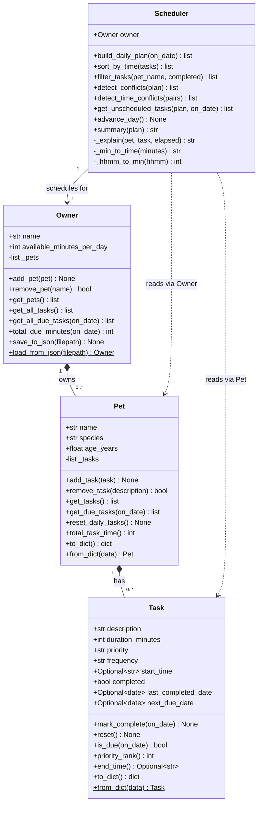

# PawPal+ — Class diagram (for `uml_diagram.png`)

This diagram reflects **`pawpal_system.py`** (`Task`, `Pet`, `Owner`, `Scheduler`).

**Export for submission:** Copy only the fenced block below into **[Mermaid Live Editor](https://mermaid.live/)** -> Actions -> **Export PNG** -> save as `assets/uml_diagram.png`.

