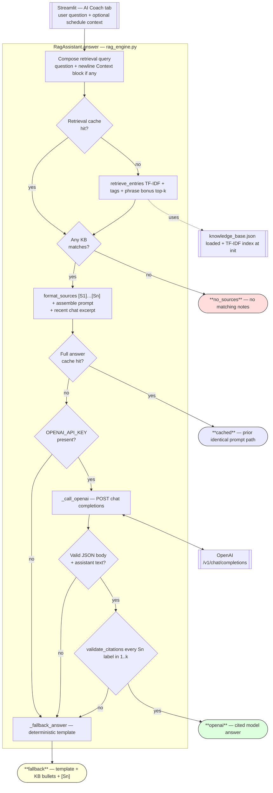

# PawPal+ — One-picture RAG + LLM + fallback (`rag_engine.py`)

Copy the **single fenced block** below into **[Mermaid Live](https://mermaid.live/)** -> **Export PNG** -> save as `assets/uml_rag.png` (or merge with your domain diagram in an image editor if you truly need everything in one raster).

For a deeper **sequence** view only, still see **`claude/doc/architecture.md`** §3.3.

---

## Single diagram (UI → retrieval → OpenAI vs fallback → three modes)

**How to read it:** Red = refuse (nothing retrieved). Green = live model with valid `[Sn]`. Yellow = deterministic fallback (no key, API error, bad parse, or invalid/missing citations). Purple = exact cache replay.
